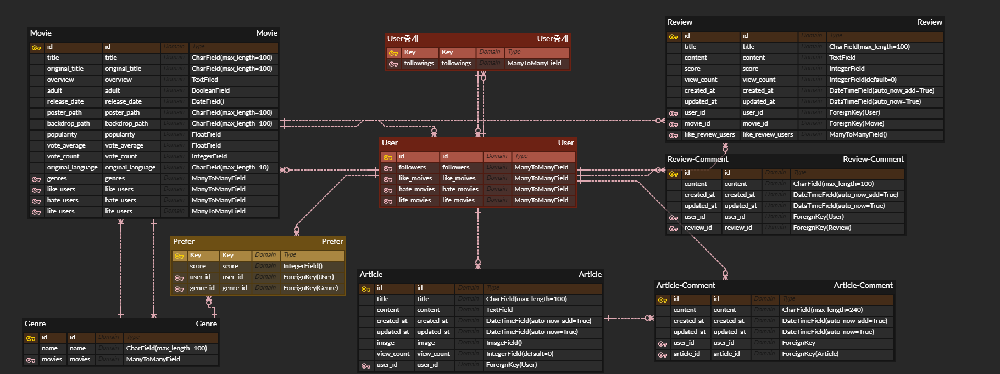

# README

## Description

이 프로젝트는 집에 있는 시간이 늘면서 무슨 영화를 볼 지 고민하는 사람이 많아졌지만(`Problem Statement`) 개인 취향을 고려한 영화를 추천하기엔 어렵기 때문에(`Constraint`) **좋아요**와 **싫어요**를 통해 개인 취향을 고려한 영화 추천 알고리즘을 구현하여 사용자에게 맞춘 영화 추천 웹사이트를 제공하는 것을 목표로 진행되었습니다.


## 개발 도구

- Django Framework
- HTML / CSS
- JavaScript
- Bootstrap4
- Python 3.7
- VS Code
- Google Chrome


## 프로젝트 구조

해당 프로젝트는 **Django** 와 **Vanila JS**만을 **사용**합니다.

- `html` 파일은 django template language와 vanila JS로 작성되었습니다.
- `html` 파일에서는 bootstrap4과 CSS를 이용해서 UI를 꾸몄습니다.
- `grid` 를 적용하여 **반응형 웹사이트**로 구현되었습니다. 

```
Final-PJT/
    return_movie/
        __init__.py
        settings.py
        urls.py
        wsgi.py
        
    accounts/
    	migrations/
    		...
    	templates/
    		accounts/
    			... (파일 설명 부분 참고)
    	admin.py
    	forms.py
    	models.py
    	urls.py
    	views.py
    	
    community/
    	templates/
    		community/
    			... (파일 설명 부분 참고)
    	admin.py
    	forms.py
    	models.py
    	urls.py
    	views.py
    	
    movies/
    	templates/
    		movies/
    			... (파일 설명 부분 참고)
    	fixtures/
    		movies/
    			movie_genre.json
    			moviedata.json
    	admin.py
    	forms.py
    	models.py
    	urls.py
    	views.py
    	
    templates/
    	base.html
    	
    static/
    	img/
    		logo.png
    media/
    	reviews/
    		image.jpg
    ...
    .env
    README.md
    db.sqlite3
    manage.py
    
    images/
    	... (README용 image)
```

### PJT 주요 디렉토리 구조


## 유스케이스


## 시작하기

1. 가상환경 구축 및 가상환경에서 진행

   ```bash
   # 가상환경 구축
   $ python -m venv venv
   
   # 가상환경으로 들어가기 
   $ source venv/Scripts/activate
   # mac 환경이면 $ source venv/bin/activate
   ```

2. 구동에 필요한 패키지 설치

   ```bash
   $ pip install -r requirements.txt
   ```

3. 서버 실행

   ```bash
   $ python manage.py runserver
   ```


## 의존성

- 모든 코드는 Python 3과 JavaScript, Django Template으로 작성되었습니다.
- 해당 프로젝트는 Django Framework를 사용하여 구성되었습니다.


## 파일 설명

#### 1. 비 파이썬 파일:

| 파일 이름            | 기술                                                      |
| -------------------- | --------------------------------------------------------- |
| README.md            | 프로젝트의 설명을 위한 텍스트 파일(마크 다운 형식)        |
| movie_genre.json     | 프로젝트에 저장될 데이터 중 영화 장르에 대한 json 파일    |
| moviedata.json       | 프로젝트에 저장될 데이터 중 영화에 대한 json 파일         |
| 유스케이스 기술서.md | 영화 추천 유스케이스를 기술한 텍스트 파일(마크 다운 형식) |
| erd.png              | 프로젝트의 모델링을 위한 erd(png 형식)                    |

- `json` 파일의 경우 `movies/fixtures/movies/` 디렉토리 안에 존재하며 `python manage.py loaddata movies/{ json 파일 명 }`으로 DB에 저장할 수 있습니다.
  - 반드시 `movie_genre.json` → `moviedata.json` 순으로 `loaddata`하셔야 error가 나지 않습니다.
  - 해당 error는 `moviedata.json` 내에 `genres` field가 id 값으로 연결되어 있기 때문에 나는 error 입니다.

#### 2. 파이썬 파일:

| 파일 이름   | 기술                                                         |
| ----------- | ------------------------------------------------------------ |
| models.py   | 해당 App에서 사용될 DB의 모델을 정의합니다.                  |
| forms.py    | 해당 App에서 실제로 보여줄 모델의 형식을 정의합니다.         |
| admin.py    | 해당 App의 모델을 관리자가 관리할 수 있도록 정의합니다.      |
| urls.py     | 해당 App의 url 경로를 정의합니다.                            |
| views.py    | 해당 App에서 사용될 메서드를 정의합니다. template 파일과 연동되어 동작합니다. |
| settings.py | 전체 구동을 위한 기본 세팅을 정의합니다.                     |
| tmdb_api.py | TMDB API에서 데이터를 받아 json 파일을 만드는 동작을 수행합니다. |

#### (+) Django Template(`html`) 파일:

| 파일 이름 | 기술                                                     |
| --------- | -------------------------------------------------------- |
| base.html | 모든 페이지에서 기본적으로 보여줄 template을 정의합니다. |

- Accounts

  | 파일 이름                    | 기술                                                         |
  | ---------------------------- | ------------------------------------------------------------ |
  | userform.html                | 회원가입, 로그인 페이지를 출력합니다.                        |
  | profile.html                 | 사용자 페이지를 출력합니다.                                  |
  | update/password.html         | 각각 회원 정보 수정과 비밀번호 페이지를 출력합니다.          |
  | like_movies/hate_movies.html | 사용자가 좋아요한 영화와 싫어요한 영화의 출력을 위한 페이지를 출력합니다. |
  | review/article_list.html     | 사용자가 작성한 리뷰와 게시글의 출력을 위한 페이지를 출력합니다. |

- Community

  | 파일 이름        | 기술                                        |
  | ---------------- | ------------------------------------------- |
  | index.html       | 게시글 목록을 위한 페이지를 출력합니다.     |
  | articleform.html | 게시글 작성을 위한 페이지를 출력합니다.     |
  | detail.html      | 게시글 내용을 보여주는 페이지를 출력합니다. |

- Movies

  | 파일 이름           | 기술                                                         |
  | ------------------- | ------------------------------------------------------------ |
  | index.html          | 영화 목록을 위한 페이지를 출력합니다.                        |
  | movie_detail.html   | 영화 내용을 출력하고 리뷰 작성으로 넘어갈 수 있는 페이지를 출력합니다. |
  | review_detail.html  | 리뷰 내용을 출력합니다.                                      |
  | review_form.html    | 리뷰 작성을 위한 페이지를 출력합니다.                        |
  | comment_detail.html | 리뷰의 코멘트들을 출력합니다.                                |
  | genre_list.html     | 장르별로 정렬된 페이지를 출력합니다.                         |
  | recommend.html      | 사용자 맞춤 영화 추천 페이지를 출력합니다.                   |
  | ratings.html        | 사용자가 아직 평가하지 않은 영화 목록을 출력합니다.          |


## 사용한 API

### TMDB API

- 영화 데이터를 DB에 저장하기 위해서 사용합니다.
- [TMDB](https://www.themoviedb.org/?language=ko) 회원가입 후 API 키 발급 가능합니다.
  - `More` - `API` 에서 설명을 찾을 수 있습니다.
  - `본인 정보` - `계정 설정` - `API` 
  - API 요청 예시를 따라 진행하면 영화의 Detail 페이지 요청을 받아올 수 있습니다.

### YOUTUBE API

- 영화 예고편을 받아오기 위해서 사용합니다.

- 자세한 내용은 [공식문서](https://developers.google.com/youtube/v3/getting-started?hl=ko) 참고하십시오.

- 해당 API는 key 제한으로 인해 제거 후 Youtube에서 검색한 링크로 수정되었습니다.

  - YOUTUBE API가 들어갔을 때의 `movies/views.py`

    ```python
    # 영화 디테일 페이지, 유튜브 영상도 넘겨줘야한다.
    def movie_detail(request, movie_pk):
        movie = get_object_or_404(Movie, pk=movie_pk)
        reviews = movie.review_set.order_by('-created_at')
        paginator = Paginator(reviews, 10) # 여기서 쿼리가 날아감
    
        page_number = request.GET.get('page')
        page_obj = paginator.get_page(page_number)   
        # YOUTUBE_API_KEY 가져오기
        load_dotenv(verbose=True)
    
        url = f'https://www.googleapis.com/youtube/v3/search'
        params = {
            'key': os.getenv('YOUTUBE_API_KEY'),
            'part': 'snippet',
            'type': 'video',
            'maxResults': '1',
            'q': f'{movie.title}+trailer',
        }
        response = requests.get(url, params)
        response_dict = response.json()
        # print(response_dict)
        # print(response_dict['items'][-1])
        context = {
            'movie': movie,
            'youtube_items': response_dict['items'][-1],
    
            'reviews': reviews,
            'page_obj': page_obj,
        }
        return render(request, 'movies/movie_detail.html', context)
    ```

  - YOUTUBE API가 들어갔을 때의 `movies/templates/movies/movie_detail.html`

    ```html
            <!-- 예고편 -->
            <div class="row py-3 px-1 border-top">
                <h6 class="col-12 text-dark"><strong>예고편</strong></h6>
                <div class="col-12 embed-responsive embed-responsive-16by9">
                    <iframe src="https://www.youtube.com/embed/{{ youtube_items.id.videoId }}" frameborder="0" class="embed-responsive-item"></iframe>
                </div>
            </div>
    ```

    

## DB 모델링

- 모델링은 각 App에 맞게 진행되었습니다.

- 대부분의 모델이 User 모델과 연결되어 있으므로 복잡해보일 수 있습니다.

- 아래는 최종 ERD입니다. ([erdcloud.com](erdcloud.com)에서 작성)

  

- Movie와 Genre 모델에 들어가는 데이터는 `TMDB API`를 통해 받아왔습니다.


## 기능

> App 별로 기능을 설명합니다.
>
> ! 사진 파일이 많습니다.

### :black_small_square: Accounts


#### 1. 팔로우 기능


- 팔로우는 유저 프로필 페이지에서 가능합니다.
  - 유저 프로필 페이지 진입하기
    - 영화의 리뷰, 댓글 작성자 이름 누르기
    - 커뮤니티의 게시글, 댓글 작성자 이름을 누르기
    - 팔로워나 팔로잉을 눌러 팔로워 / 팔로잉 리스트를 통해 이동하기
- 팔로우 버튼을 통해 해당 유저를 **팔로우**를, 체크표시된 유저를 눌러서 **언팔로우**를 할 수 있습니다.

#### 2. 유저의 활동 내용 기록


- **작성한 리뷰**와 **커뮤니티 게시글**은 누르면 해당 유저가 작성한 목록을 볼 수 있습니다.
- 좋아요 한 영화와 싫어요한 영화의 아래를 누르면 각 영화의 내역이 나오며 평가 취소가 가능합니다.
- **인생영화**는 본인을 팔로우 한 유저에게 영화를 추천하기 위한 부분입니다.
  - 해당 평가는 영화 추천 알고리즘에는 반영되지 않습니다.

#### 3. 사용자 정보 수정

- 사용자 **본인의 프로필 페이지**에서 화면 상단 오른편에 있는 **회원정보수정**을 통해 회원정보 수정이 가능합니다.

  - 해당 페이지에서 회원 정보 수정 | 비밀번호 변경 | 회원 탈퇴가 가능합니다.

  

### :black_small_square: Movies


#### 1. 정렬 및 검색


- Main페이지(`Home`)에서는 정렬과 검색이 가능합니다.
- 영화 검색에서 제목을 입력한 후  `Search`를 누르면 해당 제목(or 원제목)이 포함된 영화 목록이 나옵니다.
- 오른쪽 하단을 보면 `OO순` 과 `장르별`이 있습니다. 2가지 방법으로 아래에 출력되는 영화 목록을 정렬할 수 있습니다.

#### 2. 영화 평가 (좋아요 | 싫어요 | 인생영화)


- 영화 메인 페이지에서 영화에 대한 평가가 가능합니다.
- 좋아요와 싫어요는 해당 사용자를 위한 영화 추천에 반영됩니다.
- 인생영화는 팔로워들에게 추천하고 싶은 영화를 선택하는 기능입니다.

#### 3. 영화 & 리뷰 (평점)

- 영화 페이지 하단의 버튼 `리뷰 작성하기`를 통해 리뷰 작성이 가능합니다.

- 리뷰를 통해 별점을 매길 수 있습니다.

  

  - 리뷰 작성자를 제외한 로그인한 사용자는 리뷰 좋아요를 할 수 있습니다.
  - 해당 리뷰 역시 댓글 작성이 가능합니다.


#### 4. 추천 영화 (좋아요 | 싫어요 기반 영화 추천)


- 평가를 한 영화가 1개 이상이 되면 맞춤 추천을 받을 수 있습니다.
- 해당 페이지는 추천 알고리즘을 통해 선택된 영화들 중 10개만을 랜덤하게 가져옵니다.
  - 추천 알고리즘은 README 후반의 **요구된 필수 기능**의 **3. 추천 알고리즘**을 참고하세요.
  - 아직 평가되지 않은 영화들만이 추천됩니다. (즉, 평가를 마친 영화는 추천되지 않습니다.)

#### 5. 평가되지 않은 영화 목록


- 영화 평가만을 빠르게 하기 위해 구성된 페이지 입니다.


### :black_small_square: Community

- 자유게시판 목록입니다. 영화에 대해서 자유롭게 이야기를 나눌 수 있습니다.
- 게시글은 인기순과 최신순으로 정렬됩니다. 
- 게시글 CRUD가 가능합니다. 게시글에 이미지를 넣을 수 있습니다.
- 댓글 작성과 삭제가 가능합니다.


---


## 프로젝트

> 팀 프로젝트 (2인)
>
> Git 개발 환경 내에서 진행 (Git 개발 환경 구축은 [git setting.md 파일](https://lab.ssafy.com/yusj1231/final_pjt/blob/master/%EC%9E%90%EB%A3%8C/git%20%EC%82%AC%EC%9A%A9%ED%95%98%EA%B8%B0/git%20setting.md) 참고)

### 목표 달성도


- Youtube API Key 사용 제한으로 인해 예고편 받아오기 기능 제거했습니다.
- 검색시 연관 검색어 뜨게 하는 기능 구현 - 시간 문제로 포기했습니다.

### 진행 과정


### 업무 분담

> 프로젝트 외
>
> - 제출 UCC 제작: 유수정
> - 제출 PPT 제작: 김영주
> - UCC 포함 - 발표용 PPT 제작: 김영주 & 유수정
> - 서버 배포: 김영주
>
> 프로젝트 부분은 아래와 같이 기능 별로 분담하여 진행했습니다.


## 요구된 필수 기능

#### 1. 관리자 뷰

> 관리자 권한의 유저만 영화 등록 / 수정 / 삭제 | 유저 관리 권한을 가집니다.

```python
# movies/admin.py
from django.contrib import admin
from .models import Movie


admin.site.register(Movie)

# accounts/admin.py
from django.contrib import admin
from django.contrib.auth import get_user_model


User = get_user_model()

# 유저 관리 권한
admin.site.register(User)
```


#### 2. 영화 정보

- TMDB API를 통해 Movie 모델에 약 7천 개 이상의 영화 정보를 저장했습니다.

  

- 영화의 평점은 해당 영화의 `Review`를 작성하여 줄 수 있습니다.

  ```python
  # movies/views.py
  
  # 리뷰 생성
  @login_required
  def review_create(request, movie_pk):
      movie = get_object_or_404(Movie, pk=movie_pk)
      if request.method == 'POST':
          form = ReviewForm(request.POST)
          if form.is_valid():
              review = form.save(commit=False)
              review.movie = movie
              review.user = request.user
              review.save()
              # movie 평점 변환
              movie.vote_count += 1
              movie.vote_average = round(((movie.vote_average * movie.vote_count) + review.score) / movie.vote_count, 2)
              movie.save()
              return redirect('movies:review_detail', movie.pk, review.pk)
      else:
          form = ReviewForm()
      context = {
          'movie': movie,
          'form': form,
      }
      return render(request, 'movies/review_form.html', context)
  
  # 리뷰 수정
  @login_required
  def review_update(request, movie_pk, review_pk):
      review = get_object_or_404(Review, pk=review_pk)
      if request.user != review.user:
          return redirect('movies:review_detail', movie_pk, review.pk)
  
      # 점수 반영
      origin_score = review.score
      movie = get_object_or_404(Movie, pk=movie_pk)
      if request.method == 'POST':
          form = ReviewForm(request.POST, instance=review)
          if form.is_valid():
              review = form.save()
              diff_score = review.score - origin_score
              movie.vote_average = round(((movie.vote_average * movie.vote_count) + diff_score) / movie.vote_count, 2)
              movie.save()
              return redirect('movies:review_detail', movie_pk, review.pk)
      else:
          form = ReviewForm(instance=review)
      context = {
          'form': form,
      }
      return render(request, 'movies/review_form.html', context)
  
  # 리뷰 삭제
  @require_POST
  @login_required
  def review_delete(request, movie_pk, review_pk):
      review = get_object_or_404(Review, pk=review_pk)
      movie = get_object_or_404(Movie, pk=movie_pk)
      if request.user == review.user:
          review.delete()
          movie.vote_count -= 1
          movie.vote_average = round(((movie.vote_average * movie.vote_count) - review.score) / movie.vote_count, 2)
          movie.save()
          return redirect('movies:movie_detail', movie_pk)
      return redirect('movies:review_detail', movie_pk, review.pk)
  ```


#### 3. 추천 알고리즘

- 알고리즘

  > 사용자가 좋아요한 영화의 장르엔 +1 점, 싫어요한 영화의 장르엔 -1 점이 부과됩니다.
  >
  > 해당 점수를 기반으로 상위 3개 장르에 영화들 중 10개를 랜덤으로 뽑아서 추천합니다.
  >
  > 단, 이미 평가된 영화들은 추천에서 제외됩니다.

- 알고리즘 구현

  ```python
  @login_required
  def recommend(request):
      # 해당 유저의 영화 장르 선호도(내림차순)
      prefers = Prefer.objects.filter(user=request.user).order_by('-score')[:3]
  
      # 좋아요한 영화
      like_movies = []
      likes = request.user.like_movies.all()
      for like in likes:
          like_movies.append(like.title)
      
      # 싫어요한 영화
      hate_movies = []
      hates = request.user.hate_movies.all()
      for hate in hates:
          hate_movies.append(hate.title)
  
      # 인생 영화
      life_movies = []
      lifes = request.user.life_movies.all()
      for life in lifes:
          life_movies.append(life.title)
  
      # 선호하는 영화 장르
      prefer_genres = []
      for prefer in prefers:
          prefer_genres.append(prefer.genre.id)
      
      prefer_movies = Movie.objects.exclude(title__in=like_movies).exclude(title__in=hate_movies).filter(genres__in=prefer_genres).exclude(title__in=like_movies).order_by('-popularity').distinct()[:50]
      if len(prefer_movies) >= 10:
          movies = random.sample(list(prefer_movies), 10)
      else:
          movies = prefer_movies
  
      context = {
          'movies': movies,
      }
      return render(request, 'movies/recommend.html', context)
  ```

  

#### 4. 커뮤니티

> 자유게시판의 개념으로 구현된 APP입니다.
>
> 해당 게시판의 글은 인기, 최신 순으로 글이 정렬됩니다.

```python
# community/views.py
# 게시글 작성
@login_required
def article_create(request):
    if request.method == "POST":
        form = ArticleForm(request.POST, request.FILES)
        if form.is_valid():
            article = form.save(commit=False)
            article.user = request.user
            article.save()
            return redirect('community:detail', article.pk)
    else:
        form = ArticleForm()
    context = {
        'form': form
    }
    return render(request, 'community/articleform.html', context)

# 게시글 수정
@login_required
def article_update(request, article_pk):
    article = get_object_or_404(Article, pk=article_pk)
    if request.user == article.user:
        if request.method == "POST":
            form = ArticleForm(request.POST, instance=article)
            if form.is_valid():
                form.save()
                return redirect('community:detail', article.pk)
        else:
            form = ArticleForm(instance=article)
        context = {
            'form': form
        }
    return render(request, 'community/articleform.html', context)

# 게시글 삭제
@require_POST
@login_required
def article_delete(request, article_pk):
    article = get_object_or_404(Article, pk=article_pk)
    if request.user == article.user:
        article.delete()
        return redirect('community:index')
    return redirect('community:detail', article.pk)

# 댓글 작성
@login_required
def comment_create(request, article_pk):
    article = get_object_or_404(Article, pk=article_pk)
    if request.method == "POST":
        form = ArticleCommentForm(request.POST)
        if form.is_valid():
            comment = form.save(commit=False)
            comment.user = request.user
            comment.article = article
            comment.save()
    return redirect('community:detail', article.pk)
```


#### 5. 기타

- 페이지들은 README 상단의  **파일 설명**에서 **Django Template(`html`) 파일** 부분을 참고해주십시오.
- `get_object_or_404`를 통해 존재하지 않는 주소는 `404` 상태코드를 보냅니다.
- 좋아요, 싫어요, 인생영화의 경우 `@login_required` 대신 JS 상에서 `alert` 메시지를 띄웁니다.
- 좋아요, 싫어요, 인생영화는 `axios` 비동기 요청으로 구현되어 있습니다.


## 배포 서버 URL

- [배포 서버 바로가기](http://52.15.175.139/)


