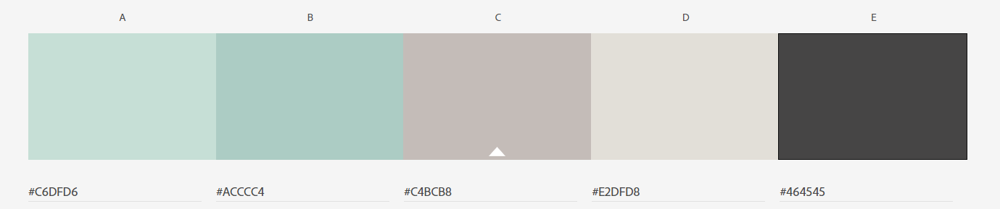
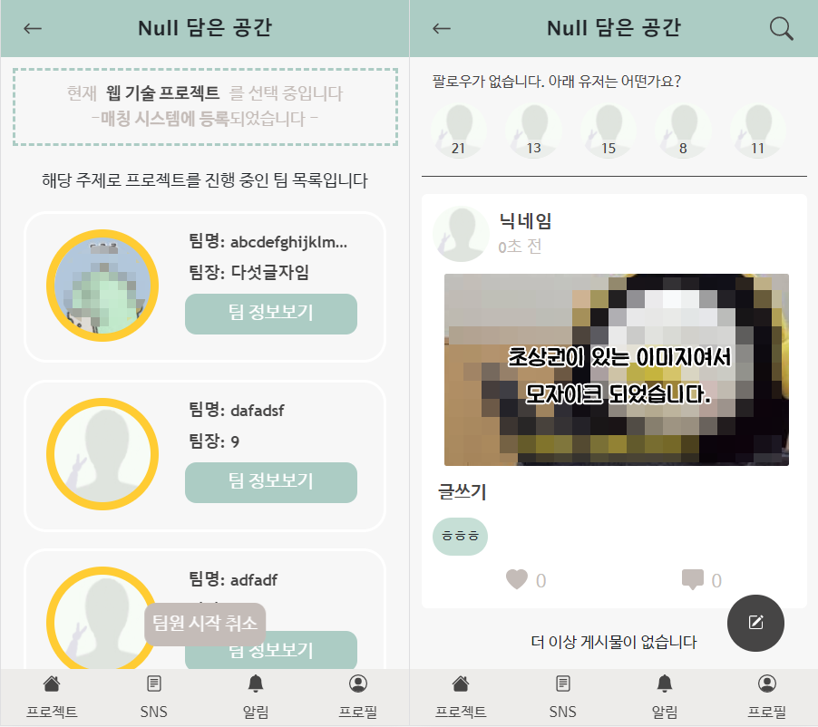
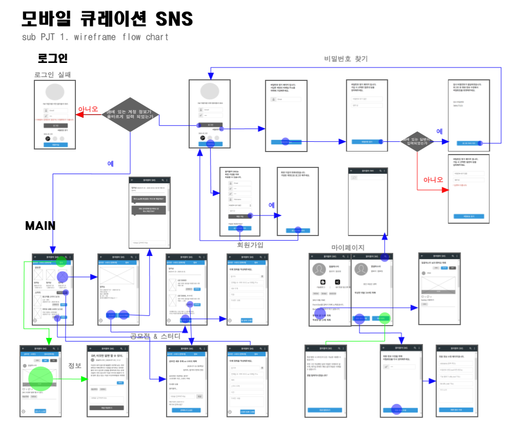
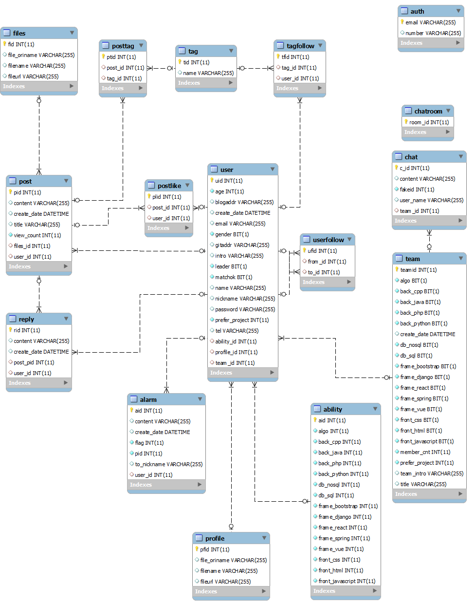

# README

## NULL 담은 공간


개발자들에게 친숙한 **NULL값**과 **너를**의 이중적인 의미를 담아서 SW 개발자를 위한 SNS, **NULL 담은 공간**으로 이름 지어졌습니다.


## Description

NULL 담은 공간은 **SW 개발자들을 위한 모바일 SNS**입니다. 기본적인 SNS 기능에 추가적으로 개발자들을 위한 특수한 프로젝트 팀원 매칭 기능을 도입하였습니다.  프로젝트의 기술 스택과 사용자들의 개발 능력을 이용하여 특별한 알고리즘을 통해 프로젝트에 어울리는 팀원들을 추천합니다. 개발자들이 프로젝트 팀원을 구하는 것에 더 이상 힘들지 않도록 NULL 담은 공간이 개발자들과 함께합니다.


## Development Tools

### :black_medium_small_square: Tools

| Tool                                                         | 기술                                                  |
| ------------------------------------------------------------ | ----------------------------------------------------- |
| [GitLab](https://about.gitlab.com/)                          | 버전 관리 및 각 개발자 별로 branch를 나눠서 코드 관리 |
| [Jira](https://www.atlassian.com/ko/software/jira)           | Issue 관리를 위해 Git과 연동하여 사용                 |
| [Docker](https://www.docker.com/)                            | APP 구축, 테스트 및 배포를 위한 SW 플랫폼             |
| [Eclipse](https://www.eclipse.org/)                          | Backend 구현 Tool                                     |
| [VS Code](https://code.visualstudio.com/)                    | Frontend 구현 Tool                                    |
| [Mysql workbench](https://www.mysql.com/products/workbench/) | DataBase Tool                                         |
| Google Chrome                                                | 구현한 화면을 출력하기 위한 브라우저                  |

### :black_medium_small_square: Library

| Library                                               | 기술                                      |
| ----------------------------------------------------- | ----------------------------------------- |
| [Spring](https://spring.io/projects/spring-framework) | Backend 서버 구현을 위한 Java Framework   |
| [Vue.js](https://vuejs.org/)                          | Frontend 구현을 위한 JavaScript Framework |
| [JPA](https://spring.io/projects/spring-data-jpa)     | DataBase 구현을 위한 Spring ORM           |
| [mariaDB](https://mariadb.com/)                       | DataBase 구현                             |
| [BootStrap](https://bootstrap-vue.org/)               | Frontend 화면 구현을 위한 Library         |

### :black_medium_small_square: Software Language

| Language   | 기술                                     |
| ---------- | ---------------------------------------- |
| Java       | Backend 서버 구현 언어 (Spring Framwork) |
| JavaScript | Frontend 구현 언어(Vue.js Framework)     |
| HTML/CSS   | Frontend 구현 언어(Vue.js Framework)     |
| sql        | DataBase 구현                            |

### :black_medium_small_square: ETC Tools

| Tool                              | 기술                                 |
| --------------------------------- | ------------------------------------ |
| [oven](https://ovenapp.io/)       | Wireframe 작성에 사용한 목업 Tool    |
| [Typora](https://typora.io/)      | MarkDown 문서 작성                   |
| [movavi](https://www.movavi.com/) | UCC 제작을 위한 동영상 편집 프로그램 |


## Install

### 1. docoker에 mariadb를 설치

> 아래 과정은 [블로그(링크)](velog.io/@hongji3354/Docker를-사용해서-MariaDB-설치하기)를 참조하였습니다.

1. **windows powershell 실행**

2. **MariaDB image Download**

   ```powershell
   docker pull mariadb
   ```

3. **Container**

   ```powershell
   docker run --name mariadb -d -p 3306:3306 -e MYSQL_ROOT_PASSWORD=1234 1234
   ```

4. **Mysql workbench을 실행해서 New Connect 생성**
5. **Docker에 설치된 mariaDB 를 실행**

### 2. Local - Server 환경 변경

```bash
$ sh Modifyfiles.sh
```

### 3. Server(spring) 실행

Eclipse에서 SNS_Backend folder를 가져와 실행합니다.

### 4. Vue.js 실행

1. **vue/cli 설치**

   ```bash
   $ npm install -g @vue/cli
   ```

2. **package 설치**

   ```bash
   $ npm i
   ```

3. **실행**

   ```bash
   $ npm run serve
   ```

   

## Project Construction

> 해당 프로젝트는 **Spring**과 **Vue.js**를 사용합니다.
>
> 각 구조 확인: [Back end](./document/backend/Backend.md/#Directory) | [Front end](./document/frontend/Frontend.md/#Directory)

### 전체 구조

```python
PJT/
	Chat_Backend/
	DB/
	document/
	SNS_Backend/
	frontend/
	README.md
    docker-compose
```


## Dependency

- 해당 프로젝트는 **Backend**와 **Frontend**로 분리되어 있습니다.
- **Backend**는 `Spring framework`를 사용해 `Java`로 작성되었습니다.
- **Frontend**는 `vue.js`를 사용해 `javascript`와 `html/css`로 작성되었습니다.


## File Definition

> **SNS_Backend**와 **frontend** 디렉토리 아래의 파일들은 아래 링크를 통해 확인할 수 있습니다.
>
> 링크: [Back end](./document/backend/Backend.md/#file-definition) | [Front end](./document/frontend/Frontend.md/#file-definition)

### :black_medium_square: document

| 디렉토리 이름 | 기술                                               |
| ------------- | -------------------------------------------------- |
| backend/      | backend 관련 md 파일들을 정의합니다.               |
| frontend/     | frontend 관련 md 파일들을 정의합니다.              |
| DB/           | Database 관련 파일들이 저장됩니다.                 |
| document/     | README를 비롯한 프로젝트 관련 파일들이 저장됩니다. |
| Chat_Backend/ | 실시간채팅 관련 파일들이 저장됩니다.               |


## [User Manual](./document/UserManual.pdf)

NULL 담은 공간에서는 서비스를 원활히 사용할 수 있도록 사용자 매뉴얼(page 23)을 제공합니다.

상단의 **User Manual**을 클릭하면 매뉴얼(PDF) 파일로 연결됩니다.


## Color Map

NULL 담은 공간은 개발자를 위한 SNS인 만큼 컴퓨터 작업이 잦은 개발자들을 위해 눈이 편한 **녹색 계열의 색을 포인트로 선정**해 화면을 구성했습니다. 




## Layout

NULL 담은 공간은 모바일에 최적화된 UX입니다.

기본 상하단의 Navigation을 고정하고 아이보리색 바탕에 진회색의 텍스트를 사용했으며, 민트색으로 포인트를 주었습니다.

Color Map의 색조합을 사용하여 깔끔한 디자인으로 구현되었습니다.




## WireFrame




## ER Diagram

> Mysql workbench로 작성되었습니다.




## Progress period

총 기간: 2020.07.13 ~ 2020.08.21 (6주)

- Sub PJT 1
  - 기간: 2020.07.13 ~ 2020.07.17
  - 내용: PJT 기본 UI 구상 및 환경 구축
- Sub PJT 2
  - 기간: 2020.07.20 ~ 2020.07.31
  - 내용: PJT 기본 CRUD 기능 구현, 서버 & 프론트 연결
- Sub PJT 3
  - 기간: 2020.08.03 ~ 2020.08.21
  - 내용: PJT 완성


## Developer & Contact Information

- 김호한(ghgksdk123@naver.com)
- 조대흠(conquerer1209@gmail.com)
- 박상현(park03851@naver.com)
- 김지영(jiyoung1329@naver.com)
- 유수정(yusj1231@gmail.com)


## ⓒ Copyright

해당 프로젝트는 삼성 소프트웨어 아카데미(SSAFY)에서 진행되었습니다.  해당 기관의 동의없이 해당 프로젝트를 임의로 재배포할 수 없습니다.
