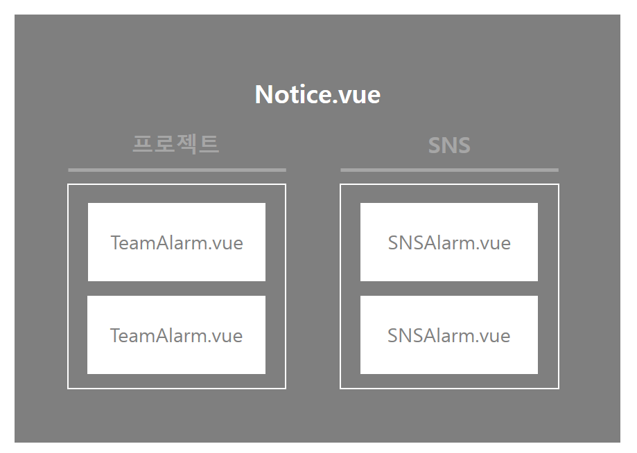

# Notice (alarm) 

## Construction

## File Definition

### :black_medium_square: src/views

| File 이름    | 기술                           |
| ------------ | ------------------------------ |
| `Notice.vue` | 사용자 알림 화면을 정의합니다. |

### :black_medium_square: src/components/notice

| File 이름       | 기술                                             |
| --------------- | ------------------------------------------------ |
| `SNSAlarm.vue`  | 알림 창의 SNS 관련 알람 component를 정의합니다.  |
| `TeamAlarm.vue` | 알림 창의 Team 관련 알람 component를 정의합니다. |

## Code

#### `Notice.vue`

> Team과 SNS 관련 알림들(tab으로 구분)을 가져와 출력한다.
>
> vue-infinite-loading로 무한스크롤을 적용한다.

- 페이지가 열릴 때(`created`) 서버에 axios 요청을 보낸다.
  - get 방식
    - `/alarm/team/${storage.getItem("NickName")}/${this.teamLimit}`
    - `/alarm/sns/${storage.getItem("NickName")}/${this.snsLimit}`
  - 받아온 data는 `TeamAlarm` 또는 `SNSAlarm`으로 내려준다.
    - radio button을 사용해서 하나의 컴포넌트만 선택되도록 한다.

## Reference

- stack overflow