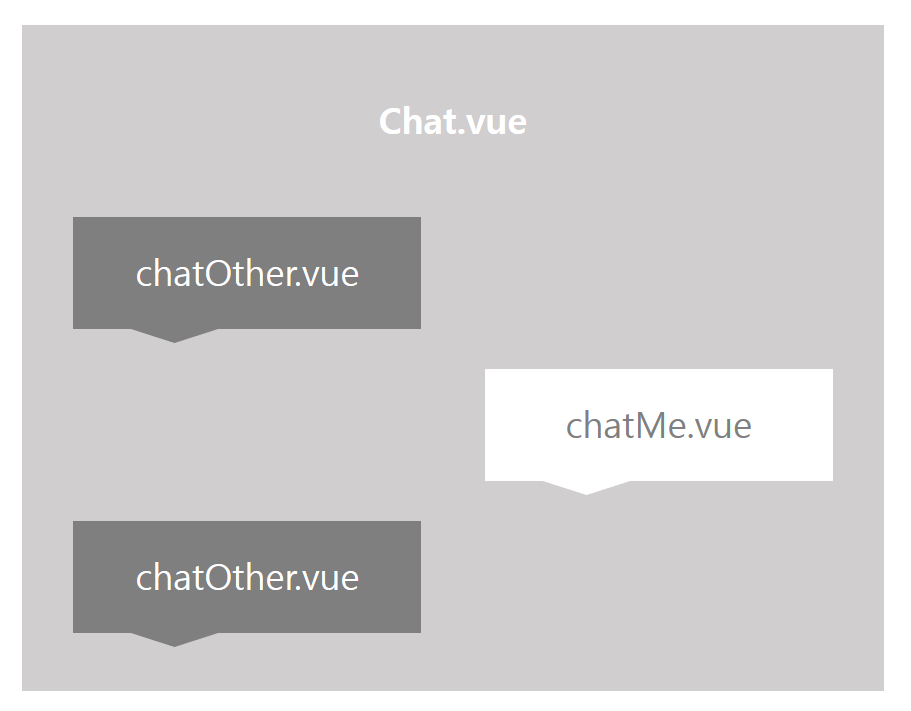

# Chat

## Construction



## File Definition

### :black_medium_square: src/views/chat

| File 이름  | 기술                             |
| ---------- | -------------------------------- |
| `Chat.vue` | 실시간 채팅 페이지를 정의합니다. |

### :black_medium_square: src/components/chat

| File 이름       | 기술                                                         |
| --------------- | ------------------------------------------------------------ |
| `chatMe.vue`    | 실시간 채팅에서 내 채팅 부분의 component를 정의합니다.       |
| `chatOther.vue` | 실시간 채팅에서 다른 유저의 채팅 부분을 component를 정의합니다. |


## Code

#### `Chat.vue`

> 실시간 채팅 페이지를 출력한다.

- 채팅 창 진입 시 채팅방 내용을 가져오기 위해 axios 요청(`get방식`)을 한다.

- 채팅 방 진입 시 소켓 연결을 한다.

  ```javascript
  connect() {
        const serverURL= "서버주소"
        let socket = new SockJS(serverURL);
        this.stompClient = Stomp.over(socket);
        // console.log(`소켓 연결을 시도합니다. 서버 주소: ${serverURL}`)
        this.stompClient.connect(
          {},
          frame => {
            // 소켓 연결 성공
            this.connected = true;
            // console.log('소켓 연결 성공', frame);
            // 서버의 메시지 전송 endpoint를 구독합니다.
            // 이런형태를 pub sub 구조라고 합니다.
            // console.log(this.teamId)
            this.stompClient.subscribe("/subscribe/chat/"+this.teamId, res => {
              // console.log('구독으로 받은 메시지 입니다.', res.body);
  ㅇ
              // 받은 데이터를 json으로 파싱하고 리스트에 넣어줍니다.
              // console.log(JSON.parse(res.body));
              this.recvList.push(JSON.parse(res.body))
              this.scrolltoBottom()
            });
          },
          error => {
            // 소켓 연결 실패
            // console.log('소켓 연결 실패', error);
            this.connected = false;
          }
        );        
      },
  ```

- 메시지 전송은 아래와 같이 이루어진다.

  ```javascript
  send() {
        // console.log("Send message:" + this.message);
        if (this.stompClient && this.stompClient.connected) {
          const msg = { 
            userName: storage.NickName,
            content: this.message,
            fakeid: this.teamId,
          };
          this.stompClient.send("/publish/chat/message",JSON.stringify(msg),{});
            // json 형식으로 serializer(stringify)해서 입력한 메시지를 보낸다.
        }
      },
  ```

  

## Reference

- [Websocket github 블로그 글](supawer0728.github.io/2018/03/30/spring-websocket)