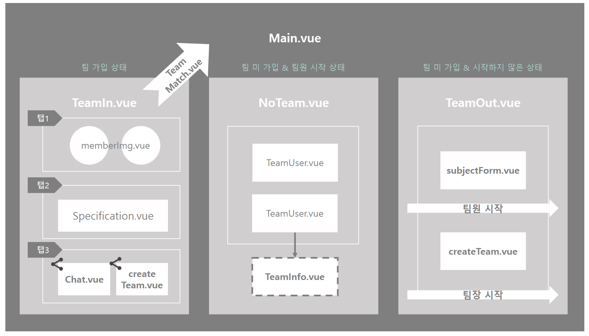
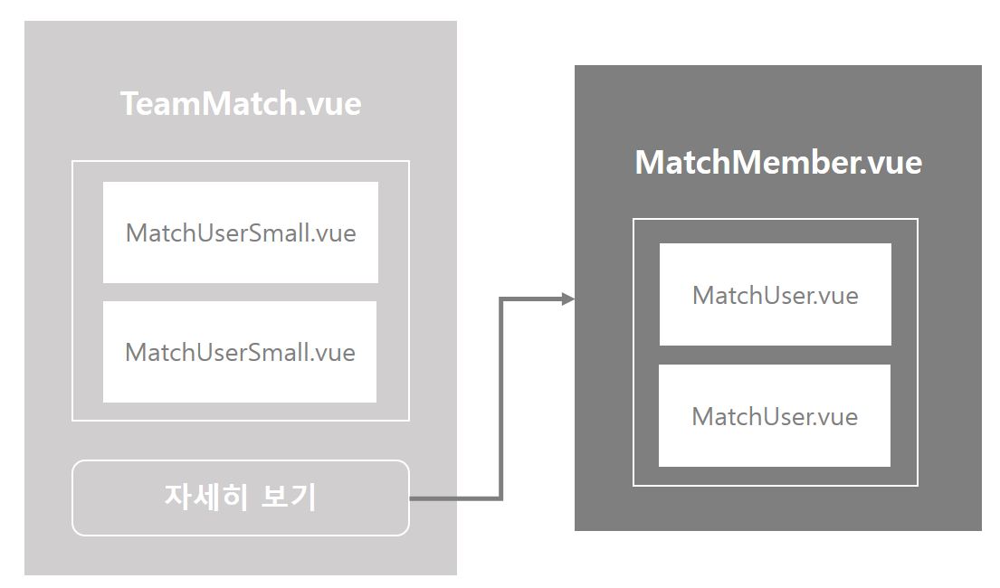

# Team

## Construction

## File Definition

### :black_medium_square: src/views

| File 이름  | 기술                                    |
| ---------- | --------------------------------------- |
| `Main.vue` | 사용자의 프로젝트 팀 화면을 정의합니다. |

### :black_medium_square: src/views/team

| File 이름         | 기술                                           |
| ----------------- | ---------------------------------------------- |
| `createTeam.vue`  | 프로젝트 팀 생성 페이지를 정의합니다.          |
| `MatchMember.vue` | 매칭된 유저들을 보여주는 페이지를 정의합니다.. |
| `subjectForm.vue` | 주제 선택 페이지를 정의합니다.                 |
| `TeamInfo.vue`    | 팀 정보 확인 페이지를 정의합니다.              |
| `teamMatch.vue`   | 팀원 매칭을 위한 페이지를 정의합니다.          |

### :black_medium_square: src/components/team

| File 이름            | 기술                                                         |
| -------------------- | ------------------------------------------------------------ |
| `MatchUser.vue`      | 매칭 결과 팀원 component를 정의합니다.                       |
| `MatchUserSmall.vue` | 매칭 결과 팀원 모습만 보여주는 component를 정의합니다.       |
| `memberImg.vue`      | 프로젝트 화면의 팀 멤버 component를 정의합니다.              |
| `NoTeam.vue`         | 팀원으로 시작한 경우 화면을 정의합니다.                      |
| `Specification.vue`  | 프로젝트 명세서 component를 정의합니다.                      |
| `TeamIn.vue`         | 팀이 있는 경우 화면을 정의합니다.                            |
| `TeamOut.vue`        | 팀이 없는 경우 화면을 정의합니다.                            |
| `TeamUser.vue`       | 팀원으로 시작한 경우 해당 주제의 팀을 출력하기 위한 component를 정의합니다. |

## Code

#### `Main.vue`

> 프로젝트 팀의 **최상단 페이지**로 사용자의 정보를 받아
>
> - 팀이 있는지(`TeamIn.vue`) 
> - 팀이 없다면 
>   - 팀원 등록을 했는지(`NoTeam.vue`)
>   - 아무것도 하지 않은 상태인지 (`TeamOut.vue`)
>
> 를 판단 후 각 경우에 적합한 화면을 출력한다.

##### 0. 사용자 판별

- 사용자 정보를 담아 axios 요청(`get방식`)을 보낸 후 받은 데이터에서 두 개의 변수를 통해 팀 여부(`T/F`)와 등록 여부(`T/F`)를 판별한다.
  - 팀 여부(`T`)시 팀이 존재(`TeamIn.vue`)
  - 팀 여부(`F`)시 등록 여부(`T`)라면 팀원 등록 상태(`NoTeam.vue`)
  - 팀 여부(`F`) & 등록 여부(`F`)라면 미등록 상태(`TeamOut.vue`)

##### 1. 팀이 있는 경우

- `Main.vue`의 화면에서 `TeamIn.vue` 컴포넌트를 출력한다.
- 3개의 Tab으로 각각 **팀 정보 / 명세서 / 설정** 으로 구성되어 있다.
- 받아온 팀 관련 데이터를 통해 팀 정보(`memberImg.vue` 등의 컴포넌트)와 명세서(`Specification.vue` 컴포넌트)를 출력한다.
- 설정에서는 실시간채팅(`Chat.vue`)으로 이동하거나 명세서 수정(`createTeam.vue`) 또는 팀 탈퇴 or 프로젝트 종료(둘 다`axios - delete`)가 가능하다.
- 팀장의 경우 **팀원 매칭**(`TeamMatch.vue`)으로 이동 가능하다.

##### 2. 팀원 등록 상태

- `Main.vue`의 화면에서 `NoTeam.vue` 컴포넌트를 출력한다.
- 등록한 주제와 함께 해당 주제를 선택한 팀 리스트(`TeamUser.vue` 컴포넌트)를 출력한다.
- 클릭 시 해당 팀 명세서 페이지(`TeamInfo.vue`)로 이동할 수 있다.
- 프로젝트 팀에게 **팀원 가입 요청**이 **가능**하다.

##### 3. 미등록 상태

- `Main.vue`의 화면에서 `TeamOut.vue` 컴포넌트를 출력한다.
- 해당 컴포넌트에서는 **팀장으로 시작 / 팀원으로 시작** 이 가능하다.
  - 팀원으로 시작 시 `subjectForm.vue` 입력 후 바로 `Main.vue`로 이동하며 **2. 팀원 등록 상태**가 된다.
  - 팀장으로 시작 시 `subjectForm.vue` 후 `createTeam.vue`를 통해 팀을 생성한 후 `Main.vue`로 이동하며 **1. 팀이 있는 경우**가 된다.

#### `teamMatch.vue`

> 프로젝트 팀의 팀장만이 접근 가능한 페이지로 프로젝트 명세서에 따라 프로젝트에 어울리는 팀원을 매칭하여 추천한다.

- 페이지 접근 시(`created`) 로딩 화면이 5초 진행된다.
- 팀 정보(팀장 닉네임)를 넣어 axios 요청(get방식)을 보내면 Backend에서 알고리즘을 통해 *같은 주제 5명, 다른 주제 5명*으로 **최대 10명**까지 유저를 **추천** 받을 수 있다.
- 매칭된 유저는 `MatchUserSmall.vue`를 통해 프로필 사진과 닉네임만 확인되며, 자세히 보기 클릭 시 `MatchMember.vue` 페이지로 이동한다.

#### `MatchMember.vue`

> `teamMatch.vue`에서 추천 받은 유저 데이터를 출력해주는 페이지이다.

- 2개의 Tab으로 **같은 주제 / 다른 주제**의 추천 받은 유저를 확인할 수 있다.
  - 같은 주제의 유저는 프로필 확인 및 팀원 요청이 가능하다.
  - 다른 주제의 유저는 위 2가지 + 프로젝트 적합도 %를 확인할 수 있다.

## Reference

- stack overflow
- loading animation html