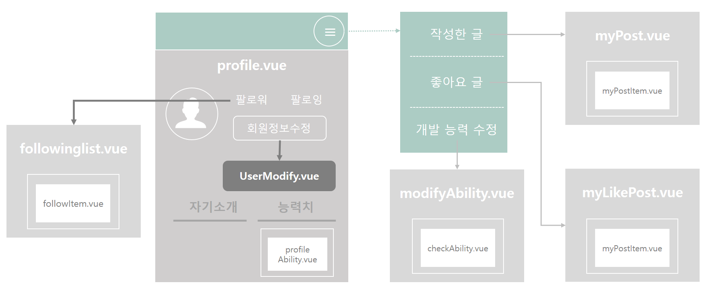

# User(profile)

## Construction

## File Definition

#### :black_medium_square: src/views/user

| File 이름            | 기술                                           |
| -------------------- | ---------------------------------------------- |
| `profile.vue`        | 사용자 계정에 대한 페이지를 정의합니다.        |
| `myPost.vue`         | 내가 작성한 게시글 목록 페이지를 정의합니다.   |
| `myLikePost.vue`     | 내가 좋아요한 게시글 목록 페이지를 정의합니다. |
| `modifyAbility.vue`  | 본인 능력치 수정을 위한 페이지를 정의합니다.   |
| `modifyPassword.vue` | 비밀번호 변경을 위한 페이지를 정의합니다.      |
| `followinglist.vue`  | 팔로우 유저 목록을 위한 페이지를 정의합니다.   |
| `UserModify.vue`     | 유저 정보 수정을 위한 페이지를 정의합니다.     |

#### :black_medium_square: src/components/user

| File 이름            | 기술                                                         |
| -------------------- | ------------------------------------------------------------ |
| `myPostItem.vue`     | 내가 쓴 게시글 component를 정의합니다.                       |
| `checkAbility.vue`   | 사용자의 능력치 입력 component를 정의합니다.                 |
| `followItem.vue`     | 팔로우 유저 component를 정의합니다.                          |
| `profileAbility.vue` | 유저 프로필 페이지의 능력치 출력을 위한 component를 정의합니다. |

## Code

#### `profile.vue`

> 유저 프로필의 **최상단 컴포넌트**로 유저 정보를 출력한다.

- router link의 params로 받은 닉네임이나 session에 저장된 본인 닉네임 정보로 axios 요청을 보낸다. 
  - axios 요청을 보내고 응답받는데 시간이 걸리므로 페이지 로딩을 `Loading` 함수로 지연시킨다.
  - get 방식: `/account/myPage/${this.nickname}/${this.pagenickname}`
    - `nickname` : 세션에 저장된 본인 닉네임
    - `pagenickname` : 프로필페이지에 출력될 닉네임 (본인인지 아닌지 구분하기 위함)
  - response data를 받아 출력한다. 
    - data 종류: 닉네임(`nickname`), 자기소개(`Introduce`), 프로필사진(`profileURL`), 팔로잉/팔로워 수(`followingcount`/`followercount`), 블로그/깃 주소(`blogURL` / `GitURL`), 능력치(`ability`), 좋아요한 태그(`tag`) 등
- 능력치(Ability)
  - 프로필에서 자기소개와 능력치는 탭으로 구분하여 보여준다.
  - profile 페이지에서 표시될 능력치는 총 15개이며 backend, frontend, database, framework, algorithm 로 분류된다. (dropdown 적용)
    - backend : cpp, java, python, php
    - frontend: html, css, javascript
    - database : SQL, noSQL
    - Framework: Spring, Django, Bootstrap, Vue, React
    - Algorithm: Algorithm
  - 각각의 능력치들은 `profileAbility.vue`로 내려서 출력한다.
- Navigation에서 profile일 경우에만 새로운 네비게이션 창 등을 통해 페이지를 이동한다.
  - 해당 유저가 작성한 글(`myPost.vue`)
  - 해당 유저가 좋아요한 글(`myLikePost.vue`)
  - 해당 유저의 팔로워 / 팔로잉 목록(`followinglist.vue`)
  - 본인 프로필 페이지인 경우엔 개발 능력 수정(`modifyAbility.vue`) / 회원정보 수정(`UserModify.vue`)

#### `myPost.vue` & `myLikePost.vue`

> 작성한 글 & 좋아요한 글의 목록을 출력한다.

- axios 요청(get방식)을 보내서 글 목록을 받아 리스트 형식의 무한 스크롤로 출력한다.
  - 요청 주소 : `/post/upload/${this.nickname}/${this.limit}`
- 해당 컴포넌트(`myPostItem.vue`)를 클릭하면 해당 게시글 상세 페이지로 이동한다.

#### `modifyAbility.vue` & `UserModify.vue`

> 본인의 능력치 & 본인 프로필 페이지를 수정한다.

- axios 요청(get방식)을 보내서 입력된 데이터를 받아온 후 수정된 데이터를 axios 요청(put방식)을 통해 저장한다.

## Reference

- stack overflow