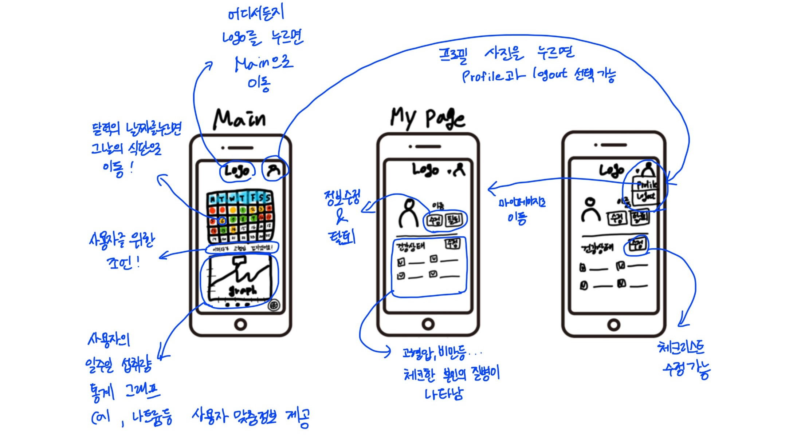
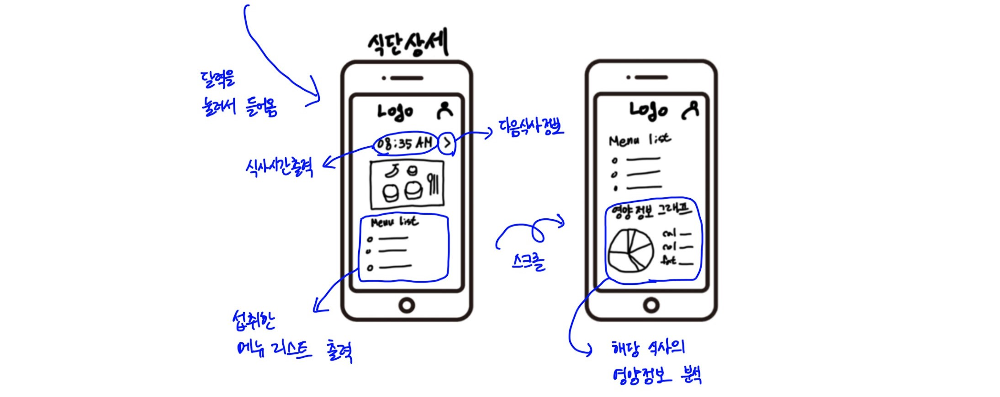
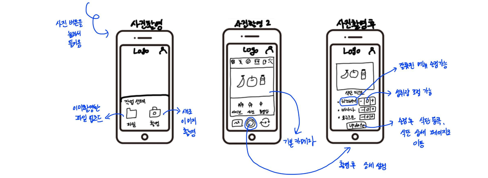
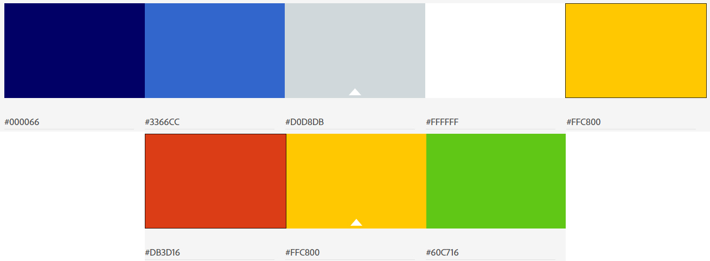

# README

## 🍚지난밥 개요

> 최근 2030세대 질환자의 사망 위험도가 증가함에 따라 식단 관리의 중요성이 강조되고 있습니다.
>
> 지난밥은 기존 식단 관리 어플들의 메뉴 직접 기입 방식에서 *사진을 입력하면 AI로 받아오는 뱡식*으로 변환하여 **사진 한 장으로 식단 기록**을 할 수 있는 어플리케이션을 목표로 기획되었습니다. 

### Why 지난밥?

> 이미 섭취된 음식에 대한 데이터를 정리하여 사용자 맞춤으로 분석하는 어플리케이션임을 명확하게 보여주는 이름을 생각했습니다. 따라서 **지나간 식사**임이 명확하게 보이는 식단 관리 프로그램, **지난밥**이 탄생했습니다.


## Install

> 기본 및 이외 설정은 [setting](./outputs/Document/Setting.md)을 참고

### Django 실행

3. 패키지 인스톨

   ```bash
   $ pip install -r requirements.txt
   ```

4. Django 실행

   ```bash
   $ python manage.py runserver
   ```


### Vue.js 실행

1. 패키지 설치

   ```bash
   $ npm i
   ```
   
2. Vue.js 실행

   ```bash
   $ npm run serve
   ```


## Project Construction 🧱

> 해당 프로젝트는 BackEnd(`Django`), FrontEnd(`Vue.js`), DataBase(`MySql`)로 구성되어 있습니다.

```python
📦PJT
 ┣ 📂lastmeal			# BackEnd
 ┃ ┣ 📂accounts				## 유저 계정 관련 App
 ┃ ┣ 📂etc					## 그 외 App
 ┃ ┣ 📂lastmeal				## BackEnd setting
 ┃ ┣ 📂menus				## menu 관련 App
 ┃ ┣ 📂media				## 식단 기록 image 저장
 ┃ ┣ 📂models				## AI model
 ┃ ┣ 📂dataset				## AI dataset
 ┃ ┣ 📂nutritional			## 영양성분 API
 ┣ 📂lastmeal-front		# FrontEnd
 ┃ ┣ 📂assets
 ┃ ┣ 📂public
 ┃ ┣ 📂src
 ┣ 📂outputs			# 산출물
 ┃ ┣ 📂Database				## DB 관련
 ┃ ┣ 📂Document				## 관련 문서
 ┃ ┣ 📂Images				## 관련 이미지파일
 ┗ 📜README.md			# 프로젝트 README
```

- 각 구조 확인
  - [BackEnd (클릭 시 이동)](./outputs/Document/BackEnd.md)
  - [FrontEnd (클릭 시 이동)](./outputs/Document/FrontEnd.md) 

### [Sequence Digram of 지난밥 Service](./outputs/Document/SequenceDiagram.md)

> 링크 참고. **전체** Sequence Diagram 


## 기능

### :black_medium_small_square: SNS 회원가입 & 로그인

- 모바일 최적화 프로그램인 지난밥 특성상 **KAKAO를 통해** 회원가입과 로그인을 할 수 있도록 구현
- KAKAO에서 제공하는 개인정보를 회원 동의를 받아 간편하게 사용할 수 있도록 구현

### :black_medium_small_square: 식단 기록

1. **카메라** or **파일 업로드**로 식단 사진을 올리면 이미지 처리를 통해 사진 속 메뉴 목록을 받아옴 ~~(별도 기입 必)~~
2. 받아온 메뉴 목록이 정확한지 확인 후 **식단 기록**을 완료

### :black_medium_small_square: 식단 확인

- Home(:house:) 화면의 달력에서 특정 날짜를 클릭 시 해당 날짜의 식단을 보여줌
  - 시간 별로 캐러셀 형식으로 제공함
    - 아침, 점심, 저녁의 일반적인 구조가 아니라 식사 시간 등의 파악을 위해 **시간으로 제공**
    - 영양 정보를 분석하여 원형 그래프로 제공

### :black_medium_small_square: 식단 분석

- 달력은 **일일 권장량 준수 여부**에 따라 색상을 분리
  - 초록색 💚: 하루 권장량 ± 15%
  - 노란색 💛: 하루 권장량 ± 30%
  - 빨간색 💖: 나머지
- 해당 달의 영양성분 별 섭취량 꺽은 선 그래프
- 최근 일주일 식단과 질병 정보를 토대로 **조언** 제공
-  최근 일주일 식단을 분석한 **주간 리포트** 제공
  - 권장량 대비 섭취율 최대/최소 영양성분
  - 과소, 과대 섭취 영양 성분
  - 영양성분 별 Bar Graph

### :black_medium_small_square: UI / UX

> 질병에 맞춘 영양소 섭취 현황을 원활하게 보여줄 수 있는 UI/UX 목표


## 유사 서비스

- 삼성 헬스 케어: 사용자가 식단을 직접 검색해서 넣어야 함
- KT AI 식단관리 솔루션: **당뇨병**만을 타깃으로 한 식단 관리 어플리케이션

- :star: **지난밥**
  - 사진 촬영 or 업로드를 사용하여 ***이미지를 통한 간단한 식단 작성***
  - 당뇨병을 포함한 5개 질병에 대한 관리 제공
  - 관리 조언을 통해 이후 식단에 대한 방향 제시


## Future Prospect ✨

> 현재(2020.10.07) 지난밥 **v1.0** 서비스가 배포 중입니다.

- 더 많은 정제된 데이터셋을 학습시켜 보다 많은 음식에 대한 데이터를 제공할 수 있습니다.
- 더 많은 질병 데이터를 분석하여 보다 다양한 질병에 대한 식단 관리를 제공할 수 있습니다.
- 식단 기록의 간편화 + 다양한 질병 분석을 통해 보다 효율적인 식단 관리를 할 수 있습니다.


## Tech Stack

### :black_medium_small_square: Tools

| Tool          | 기술                                                    |
| :------------ | :------------------------------------------------------ |
| GitLab        | 기능별 branch를 나눠서 코드 버전 관리                   |
| Jira          | Issue 관리를 위해 Git과 연동하여 사용                   |
| Scrum Poker   | Jira Issue 별 스프린트 시간 관리를 위한 어플리케이션    |
| VS Code       | code 구현을 위한 Tool                                   |
| Google Chrome | 구현한 화면을 출력하기 위한 브라우저                    |
| Jenkins       | 소프트웨어 개발 시 지속적으로 통합 서비스를 제공(CI 툴) |
| SonarQube     | 소스 코드 품질 관리                                     |

### :black_medium_small_square: Library

| Library     | 내용                                                |
| ----------- | --------------------------------------------------- |
| Django      | Backend 구현을 위한 python web framework            |
| Vue.js      | Frontend 구현을 위한 JavaScript framework           |
| Tensor-flow | 이미지 처리(CNN)를 위한 Open Source 머신러닝 플랫폼 |

### :black_medium_small_square: Software Language

| Language   | 기술                             |
| ---------- | -------------------------------- |
| Python     | Backend 및 이미지 처리 구현 언어 |
| JavaScript | Frontend 구현 언어               |
| HTML/CSS   | Frontend 구현 언어               |


## 기술 설명

### ERD


### Wire Frame







## Color Map



- 상단 5색: 전체 디자인 색상
- 하단 3색: 분석을 위해 제공하는 색상


## Version

- [2020.10.07] **v1.0** Service Start
  - 영양성분 7개( *칼로리, 탄수화물, 단백질, 지방, 당류, 나트륨, 콜레스테롤* )에 대한 분석 제공
  - 질병 6개( *당뇨, 비만, 고질혈증, 고혈압, 저체중, 신부전증* )에 대한 분석 제공


## Develop

### Develop Period

```mermaid
gantt
        dateFormat  MM-DD
        title AI PJT - Last Meal

        section A section
        아이디어 선정           	  :done,    des1, 08-31,09-04
        역할 분담	               :done,    des2, 09-04,09-05
        기본 화면 구성              :done,    des2, 09-05,09-14
        Front, Back 1차완성	   	:done,    des3, 09-15,09-21
        Front, Back 연동           :done,    des4, 09-22,09-24
        AI model 선정				 :done,    des3, 09-15,09-25
        AI model 학습				 :done,    des5, 09-26,09-30
        추가기능 구현				  :done,    des5, 09-25,10-05
        AI 적용 및 추가             :done,    des6, 09-28,10-04
        버그 디버깅                 :active   des7, after des4, 12d
```



### Developer

- 김소희 (shttr6024@naver.com)
- [오혜영](https://oheong.github.io/)
- 유수정 (yusj1231@gmail.com)
- 황신실 (ohgyosin@naver.com)
- 김현국 (khg6152450@naver.com)


## © Copyright 

해당 프로젝트는 삼성 소프트웨어 아카데미(SSAFY)를 통해 진행되었습니다.  해당 기관의 동의없이 해당 프로젝트를 임의로 재배포할 수 없습니다.
