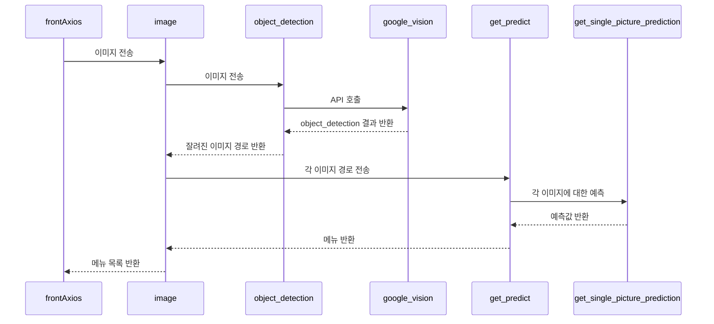

# Backend

> Django Web Framework
>
> DataBase MySql과 연결


## Directory Structure

```python
📦lastmeal
 ┣ 📂accounts					# user App
 ┃ ┣ 📂migrations
 ┃ ┣ 📂__pycache__
 ┃ ┣ 📜admin.py
 ┃ ┣ 📜apps.py
 ┃ ┣ 📜models.py
 ┃ ┣ 📜serializers.py
 ┃ ┣ 📜tests.py
 ┃ ┣ 📜urls.py
 ┃ ┣ 📜views.py
 ┃ ┗ 📜__init__.py
 ┣ 📂dataset					# AI dataset
 ┃ ┣ 📜test.tfrecord
 ┃ ┣ 📜train.tfrecord
 ┃ ┗ 📜valid.tfrecord
 ┣ 📂etc						# 그 외 관련 model
 ┃ ┣ 📂migrations
 ┃ ┣ 📜admin.py
 ┃ ┣ 📜apps.py
 ┃ ┣ 📜models.py
 ┃ ┣ 📜tests.py
 ┃ ┣ 📜views.py
 ┃ ┗ 📜__init__.py
 ┣ 📂lastmeal					# Backend setting 부분
 ┃ ┣ 📜asgi.py
 ┃ ┣ 📜settings.py
 ┃ ┣ 📜urls.py
 ┃ ┣ 📜wsgi.py
 ┃ ┗ 📜__init__.py
 ┣ 📂media						# 식단 기록 image 저장 부분
 ┃ ┣ 📂menuimages
 ┃ ┗ 📂temp
 ┣ 📂menus						# menu App
 ┃ ┣ 📂migrations
 ┃ ┣ 📂__pycache__
 ┃ ┣ 📜admin.py
 ┃ ┣ 📜apps.py
 ┃ ┣ 📜models.py
 ┃ ┣ 📜nutrient.py
 ┃ ┣ 📜serializers.py
 ┃ ┣ 📜tests.py
 ┃ ┣ 📜urls.py
 ┃ ┣ 📜views.py
 ┃ ┗ 📜__init__.py
 ┣ 📂models						# AI model
 ┃ ┣ 📜efficientnet.py
 ┣ 📂nutritional				# 영양성분 API
 ┃ ┣ 📜nutrient.json
 ┃ ┗ 📜nutrient_api.py
 ┣ 📂saved_model				# AI train save
 ┃ ┣ 📜checkpoint
 ┣ 📜configuration.py
 ┣ 📜manage.py
 ┣ 📜object_detection.py
 ┣ 📜package-lock.json
 ┣ 📜parse_tfrecord.py
 ┣ 📜predict.py					# AI image 예측
 ┣ 📜prepare_data.py
 ┣ 📜requirements.txt			# 가상환경 설치 package list
 ┗ 📜train.py
```


##  Flow Diagram

### :black_small_square: Kakao

> 회원 가입을 위한 Flow Diagram

```flow
st=>start: Start
op1=>operation: LOGIN
op2=>operation: SIGNUP
cond=>condition: is NOT None?
cond2=>condition: Success?
cond3=>condition: email?
e=>end

st->op1->cond->cond2->
op2->op1
cond(yes)->cond2
cond(no)->cond3
cond2(yes)->e
cond2(no)->op1
cond3(yes)->op2
cond3(no)->op1
```

### :black_small_square: AI image

> 받은 음식 이미지를 이미지 처리해서 메뉴 목록 반환해주는 Flow Diagram



| 함수명                          | 역할                                           | 위치                |
| ------------------------------- | ---------------------------------------------- | ------------------- |
| `image`                         | 이미지를 받아서 메뉴 목록을 반환               | menus/views.py      |
| `object_detection`              | 이미지를 받아 각 위치 별로 저장하여 반환       | object_detection.py |
| `google_vision`                 | 구글 비전 API를 호출하여 각 위치 값 받아옴     | google              |
| `get_predict`                   | 학습된 AI를 사용해 어떤 음식의 이미지인지 예측 | predict.py          |
| `get_single_picture_prediction` | 하나의 이미지에 대한 예측                      | predict.py          |