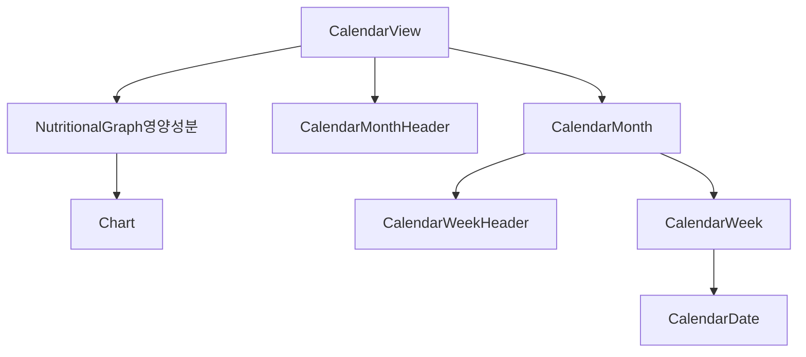
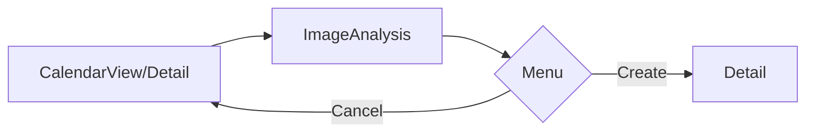
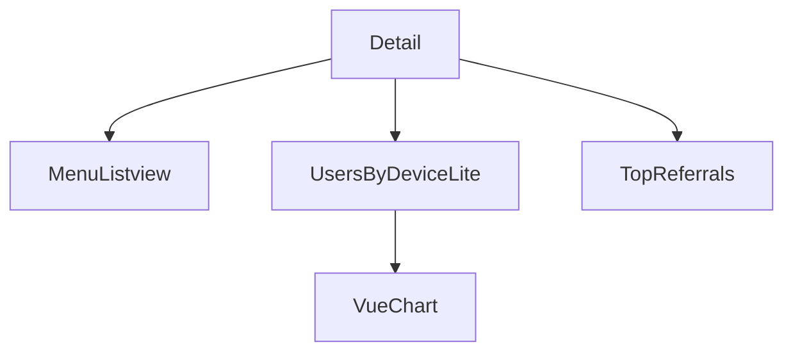
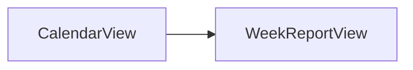
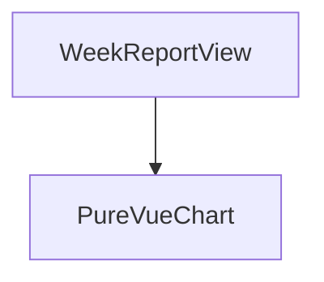
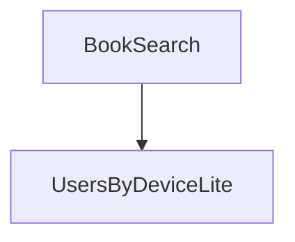
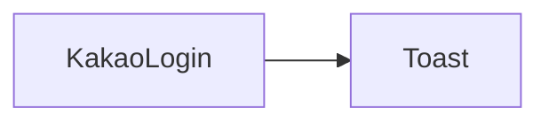
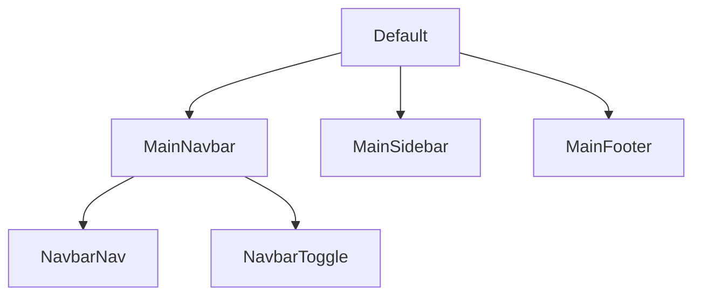

# Frontend

> Vue.js 로 구현
>
> axios 를 통해 서버 통신


## Directory Structure

```python
📦lastmeal-front
 ┣ 📂assets
 ┣ 📂public
 ┣ 📂src
 ┃ ┣ 📂assets
 ┃ ┣ 📂components						# 컴포넌트 영역
 ┃ ┃ ┣ 📂blog								## chart & menu 목록 디렉토리
 ┃ ┃ ┃ ┣ 📜MenuListview.vue
 ┃ ┃ ┃ ┣ 📜UsersByDeviceLite.vue
 ┃ ┃ ┃ ┗ 📜UsersOverview.vue
 ┃ ┃ ┣ 📂calendar							## Main - 달력 디렉토리
 ┃ ┃ ┃ ┣ 📜CalendarDate.vue
 ┃ ┃ ┃ ┣ 📜CalendarMonth.vue
 ┃ ┃ ┃ ┣ 📜CalendarMonthHeader.vue
 ┃ ┃ ┃ ┣ 📜CalendarWeek.vue
 ┃ ┃ ┃ ┗ 📜CalendarWeekHeader.vue
 ┃ ┃ ┣ 📂chart								## Chart 디렉토리
 ┃ ┃ ┃ ┗ 📜vueChart.vue							### Bar Chart
 ┃ ┃ ┣ 📂common
 ┃ ┃ ┃ ┣ 📜CountryReports.vue
 ┃ ┃ ┃ ┣ 📜Modal.vue
 ┃ ┃ ┃ ┣ 📜SmallStats.vue
 ┃ ┃ ┃ ┣ 📜Toast.vue
 ┃ ┃ ┃ ┣ 📜TopReferrals.vue
 ┃ ┃ ┃ ┗ 📜vue-fab.vue
 ┃ ┃ ┣ 📂detail
 ┃ ┃ ┃ ┗ 📜detailImage.vue
 ┃ ┃ ┣ 📂graph								## Main - 영양성분 Chart 디렉토리
 ┃ ┃ ┃ ┣ 📜NutritionalGraphCal.vue
 ┃ ┃ ┃ ┣ 📜NutritionalGraphCol.vue
 ┃ ┃ ┃ ┣ 📜NutritionalGraphDan.vue
 ┃ ┃ ┃ ┣ 📜NutritionalGraphDang.vue
 ┃ ┃ ┃ ┣ 📜NutritionalGraphJi.vue
 ┃ ┃ ┃ ┣ 📜NutritionalGraphNa.vue
 ┃ ┃ ┃ ┗ 📜NutritionalGraphTan.vue
 ┃ ┃ ┣ 📂layout								## 레이아웃 컴포넌트 디렉토리
 ┃ ┃ ┃ ┣ 📂MainFooter
 ┃ ┃ ┃ ┃ ┗ 📜MainFooter.vue
 ┃ ┃ ┃ ┣ 📂MainNavbar
 ┃ ┃ ┃ ┃ ┣ 📜MainNavbar.vue						### 상단 Navbar
 ┃ ┃ ┃ ┣ 📂MainSidebar
 ┃ ┃ ┃ ┃ ┗ 📜MainSidebar.vue
 ┃ ┃ ┃ ┣ 📜Login.vue
 ┃ ┃ ┃ ┗ 📜Login_original.vue
 ┃ ┃ ┣ 📂menu
 ┃ ┃ ┃ ┗ 📜menu.vue
 ┃ ┃ ┗ 📂user-profile-lite
 ┃ ┃ ┃ ┣ 📜UserAccountDetails.vue
 ┃ ┃ ┃ ┣ 📜UserConditionDetails.vue
 ┃ ┃ ┃ ┣ 📜UserDetails.vue
 ┃ ┃ ┃ ┗ 📜UserUpdate.vue
 ┃ ┣ 📂data
 ┃ ┃ ┗ 📜sidebar-nav-items.js
 ┃ ┣ 📂layouts							# 레이아웃 디렉토리
 ┃ ┃ ┗ 📜Default.vue						## 전체 레이아웃 최상위 컴포넌트
 ┃ ┣ 📂scss								# scss 디렉토리
 ┃ ┣ 📂utils							# util 디렉토리
 ┃ ┃ ┣ 📜axios-common.js					## axios 요청 공통 js
 ┃ ┃ ┣ 📜chart.js
 ┃ ┃ ┗ 📜index.js
 ┃ ┣ 📂views							# router 페이지 디렉토리
 ┃ ┃ ┣ 📜CalendarView.vue					## Main 컴포넌트
 ┃ ┃ ┣ 📜ComponentsOverview.vue
 ┃ ┃ ┣ 📜Detail.vue							## 해당 일자 식단 기록
 ┃ ┃ ┣ 📜Errors.vue							## Error
 ┃ ┃ ┣ 📜ImageAnalysis.vue					## 사진 ai 분석
 ┃ ┃ ┣ 📜KakaoLogin.vue						## 로그인
 ┃ ┃ ┣ 📜PersonalBlog.vue
 ┃ ┃ ┣ 📜Tables.vue
 ┃ ┃ ┣ 📜UserProfileLite.vue				## 프로필
 ┃ ┃ ┗ 📜WeekReportView.vue					## 주간 리포트
 ┃ ┣ 📜App.vue							# 최상위 컴포넌트
 ┃ ┣ 📜main.js
 ┃ ┗ 📜router.js
 ┣ 📜.browserslistrc
 ┣ 📜.editorconfig
 ┣ 📜.eslintignore
 ┣ 📜.eslintrc.js
 ┣ 📜.gitignore
 ┣ 📜babel.config.js
 ┣ 📜CHANGELOG.md
 ┣ 📜index.html
 ┣ 📜LICENSE
 ┣ 📜package.json
 ┣ 📜postcss.config.js
```


##  Flow Diagram

### :black_small_square: Main

> Home 화면을 구성하는 컴포넌트 구조를 그린 Diagram
>
> 페이지 이동 부분은 다른 부분 참고



| 파일                       | 역할                                                         | 위치                                          |
| -------------------------- | ------------------------------------------------------------ | --------------------------------------------- |
| `CalendarView`             | Main 출력                                                    | views/CalendarView.vue                        |
| `NutritionalGraph영양성분` | Main의 통계 그래프 부분으로 총 7개로 구성(Cal, Col, Dan, Dang, Ji, Na, Tan) | components/graph/NutritionalGraph영양성분.vue |
| `Chart`                    | 그래프를 그리기 위한 js (ChartData를 받는다)                 | utils/chart.js                                |
| `CalendarMonthHeader`      | Main의 달력 헤더 부분                                        | components/calendar/CalendarMonthHeader.vue   |
| `CalendarMonth`            | Main의 달력 부분                                             | components/calendar/CalendarMonth.vue         |
| `CalendarWeekHeader`       | 달력의 날짜 표시 부분                                        | components/calendar/CalendarWeekHeader.vue    |
| `CalendarWeek`             |                                                              | components/calendar/CalendarWeek.vue          |
| `CalendarDate`             |                                                              | components/calendar/CalendarDate.vue          |

### :black_small_square: Menu Create

> 식단 촬영 이미지를 받아서 기록하는 Flow Diagram



| 파일                  | 역할                                                         | 위치                                         |
| --------------------- | ------------------------------------------------------------ | -------------------------------------------- |
| `CalendarView/Detail` | 각 페이지 상단 컴포넌트                                      | views/CalendarView.vue<br />views/Detail.vue |
| `ImageAnalysis`       | 이미지분석 결과(메뉴 리스트)를 받아오는 곳                   | views/ImageAnalysis.vue                      |
| `Menu`                | 받아온 이미지 및 메뉴 리스트를 출력하고 create하는 곳 (ImageAnalysis 하위 컴포넌트) | components/menu/menu.vue                     |
| `Detail`              | 해당 날짜의 식단을 볼 수 있는 곳. Menu Detail 참고           | views/Detail.vue                             |

### :black_small_square: Menu Detail

> 하루 식단을 구성하는 Detail  화면의 컴포넌트 구조를 그린 Diagram



| 파일                | 역할                                | 위치                                  |
| ------------------- | ----------------------------------- | ------------------------------------- |
| `Detail`            | 특정 날짜의 식단들                  | views/Detail.vue                      |
| `MenuListview`      | 식단의 메뉴 리스트                  | components/blog/MenuListview.vue      |
| `UsersByDeviceLite` | 해당 식단의 영양성분 pie Chart 출력 | components/blog/UsersByDeviceLite.vue |
| `VueChart`          | pie Chart를 그리기 위한 컴포넌트    | components/chart/VueChart.vue         |
| `TopReferrals`      | 해당 식단의 영양성분 섭취량         | components/common/TopReferrals.vue    |

### :black_small_square: Weekly Report

> 오늘까지 지난 일주일의 식단을 분석하는 Flow Diagram



> Weekly Report 화면 구성을 위한 컴포넌트 Diagram



| 파일             | 역할                             | 위치                          |
| ---------------- | -------------------------------- | ----------------------------- |
| `CalendarView`   | Main 출력                        | views/CalendarView.vue        |
| `WeekReportView` | 식단의 메뉴 리스트               | views/WeekReportView.vue      |
| `PureVueChart`   | Bar Chart를 그리기 위한 컴포넌트 | components/chart/VueChart.vue |

### :black_small_square: Search Nutrient

> 해당 음식의 영양성분을 알아볼 수 있는 영양 사전 컴포넌트 구조



| 파일                | 역할                                        | 위치                                  |
| ------------------- | ------------------------------------------- | ------------------------------------- |
| `BookSearch`        | 영양정보 사전의 서치 페이지의 상단 컴포넌트 | views/Detail.vue                      |
| `UsersByDeviceLite` | 해당 식단의 영양성분 pie Chart 출력         | components/blog/UsersByDeviceLite.vue |

### :black_small_square: Login

> 카카오 로그인을 위한 컴포넌트 Digram



| 파일         | 역할                                       | 위치                        |
| ------------ | ------------------------------------------ | --------------------------- |
| `KakaoLogin` | 카카오 로그인 컴포넌트                     | views/KakaoLogin.vue        |
| `Toast`      | 로그인 여부에 대한 msg를 보내주는 컴포넌트 | components/common/Toast.vue |

### :black_small_square: Layout

> 전체 화면 레이아웃의 컴포넌트 구조를 그린 Diagram



| 파일         | 역할                                 | 위치                                        |
| ------------ | ------------------------------------ | :------------------------------------------ |
| `Default`    | 화면 구성의 최상단 레이아웃 컴포넌트 | layouts/Default.vue                         |
| `MainNavbar` | 화면 상단 Navigation bar 컴포넌트    | components/layout/MainNavBar/MainNavbar.vue |