# Sequence Diagram of 지난밥 Service 

## 1. 회원

### 1. 로그인

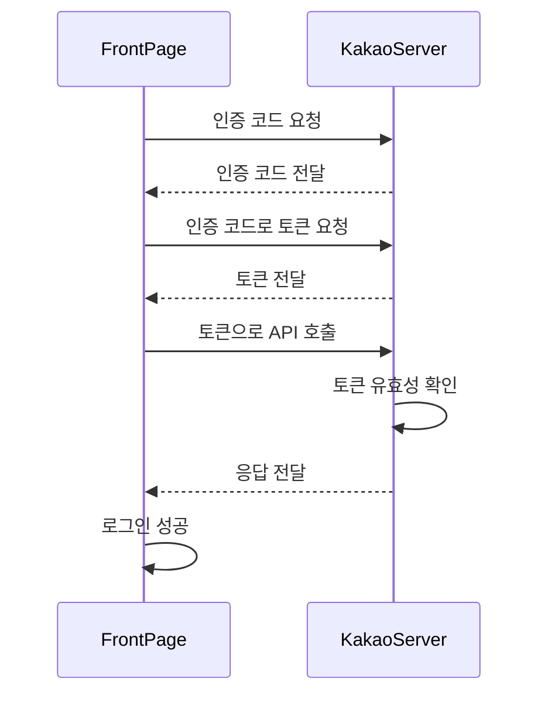

### 2. 회원가입

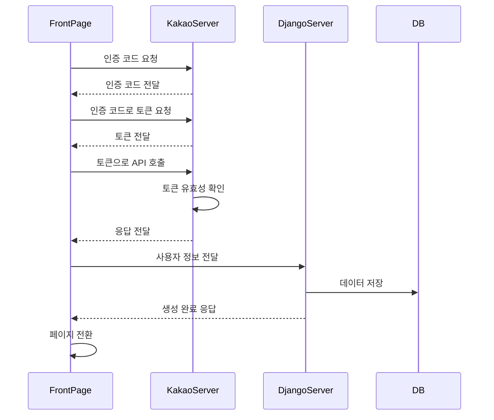

### 3. 회원 정보 수정

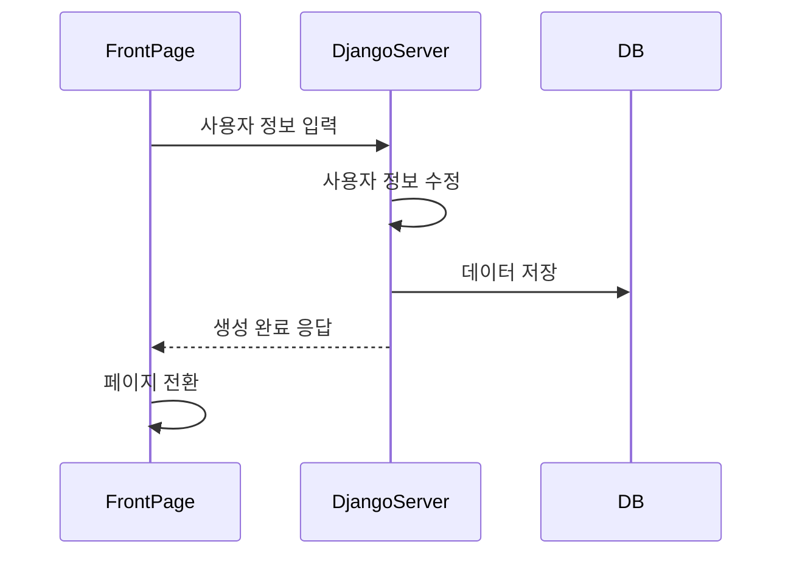

### 4. 회원 탈퇴

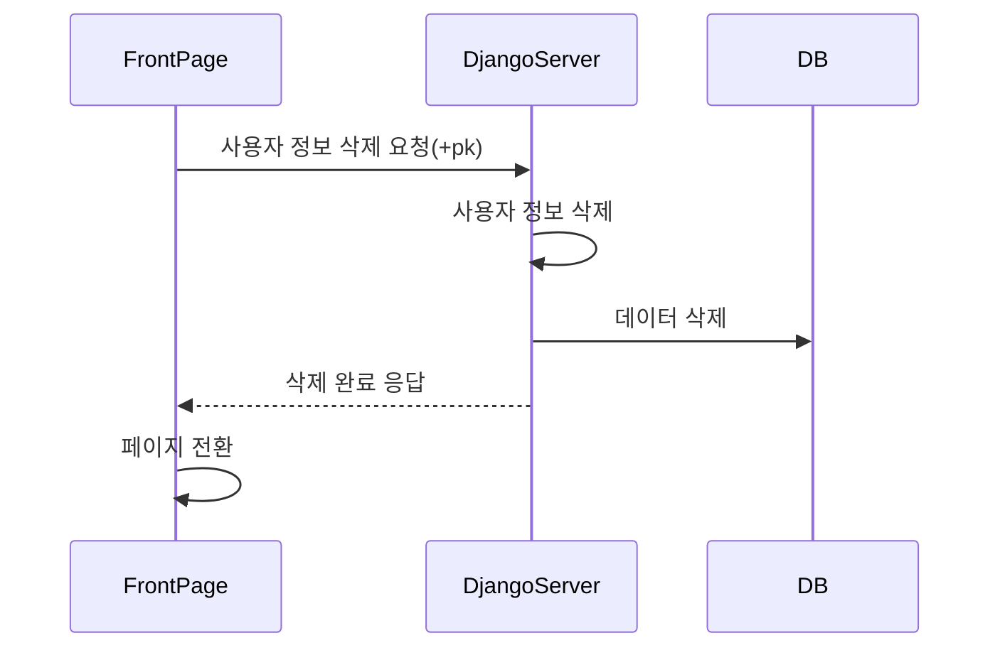

## 2. 식단

### 1. 식단 등록

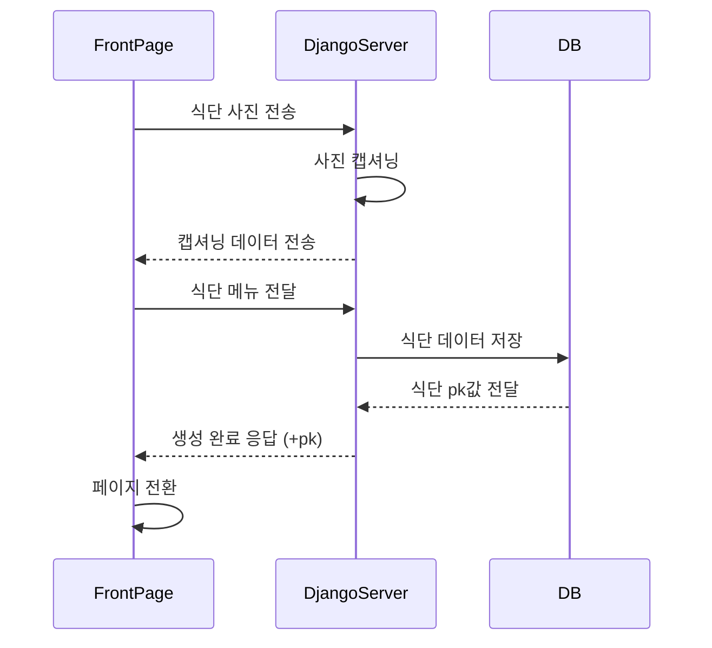

### 2. 식단 확인 

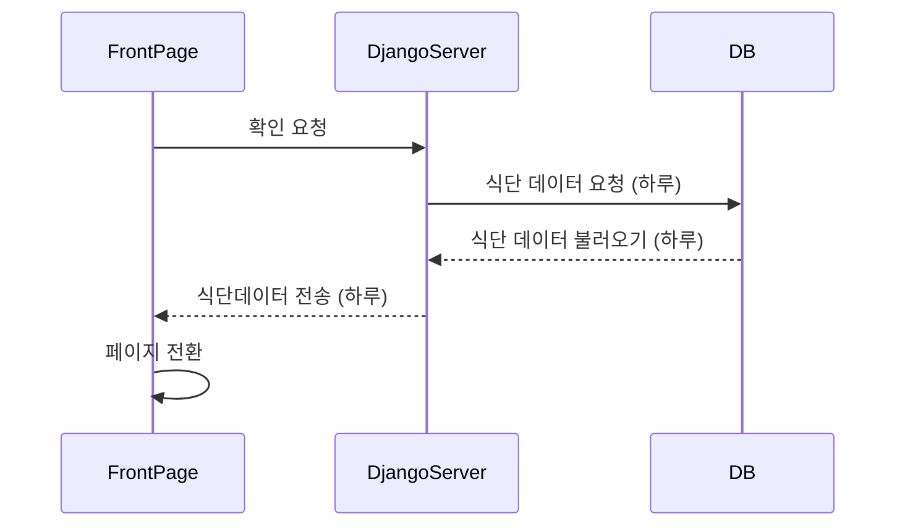

### 3. 통계정보 확인

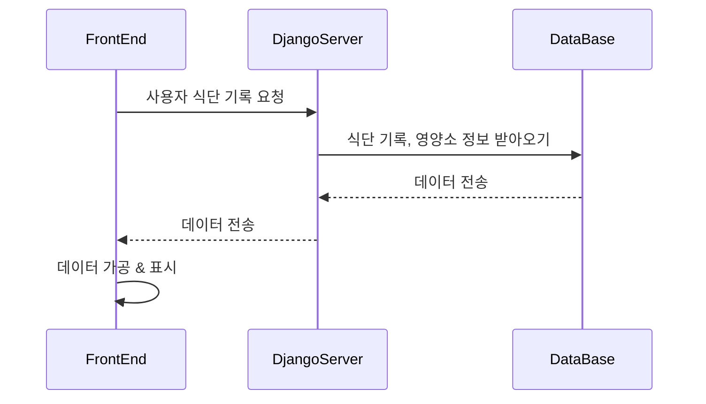

### 4. 식단 수정

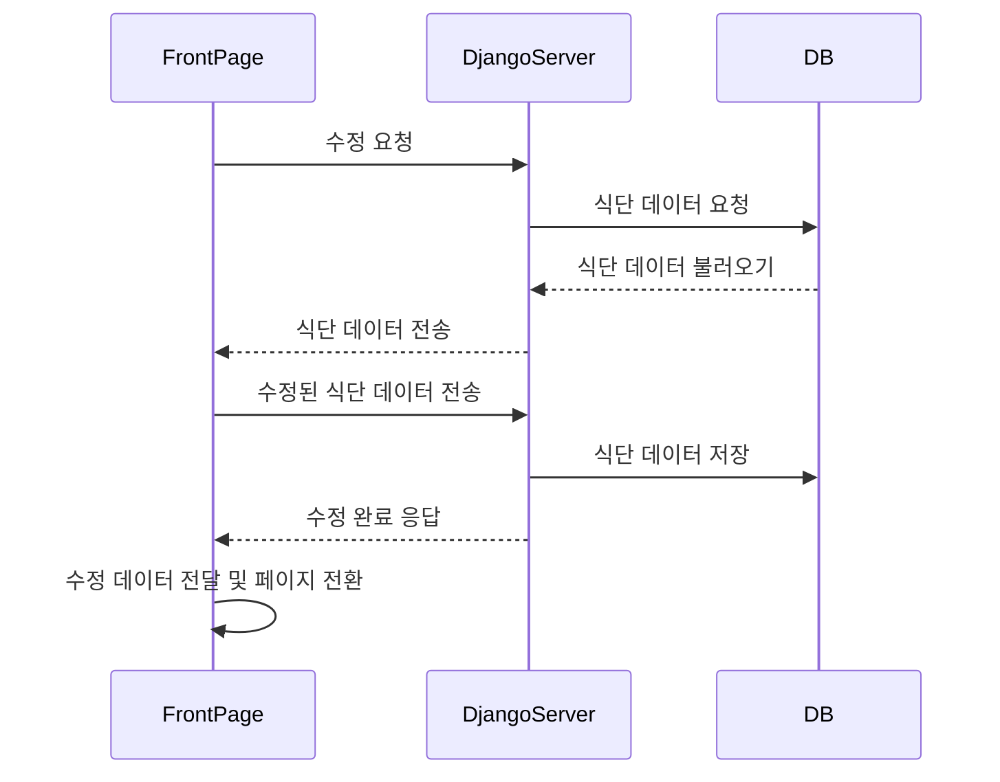

### 5. 식단 삭제

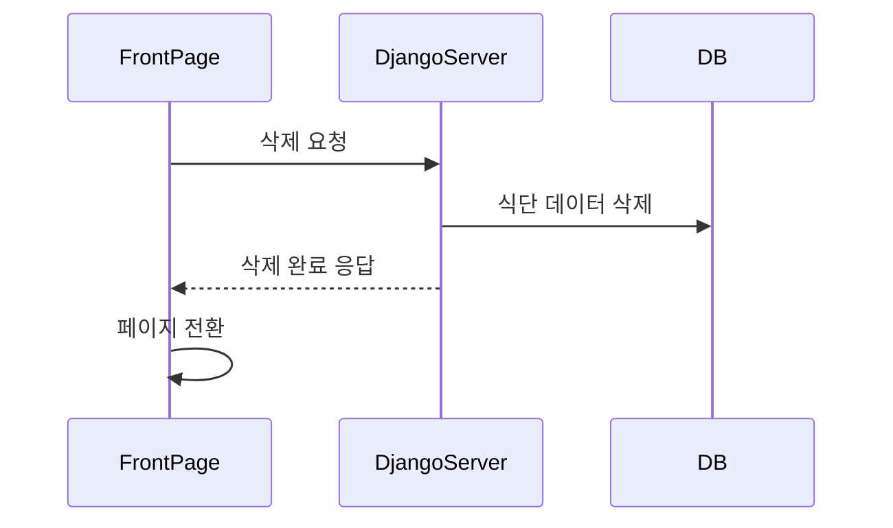

## 3. Image classification

### 1. object detection

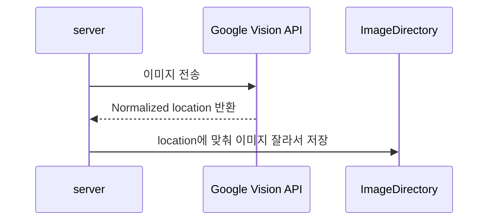

### 2. model training 

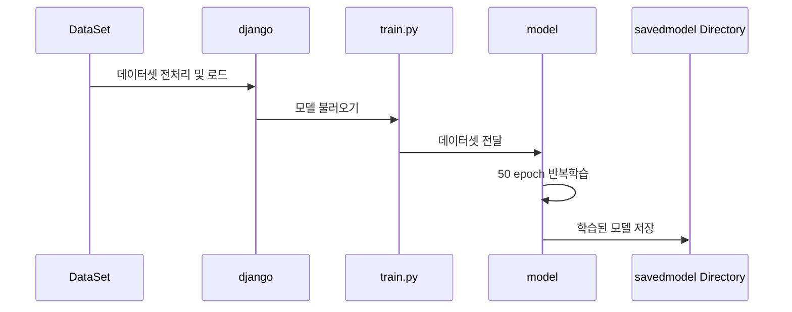

### 3. predict

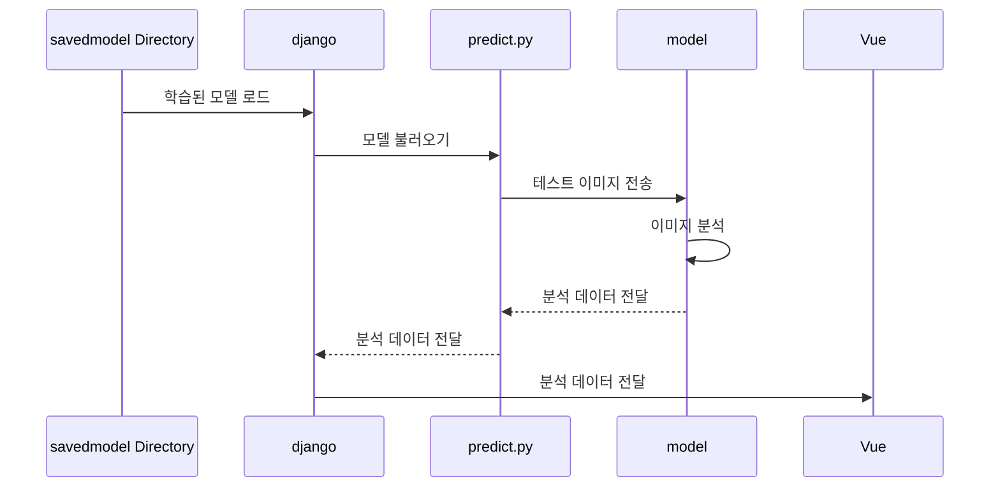