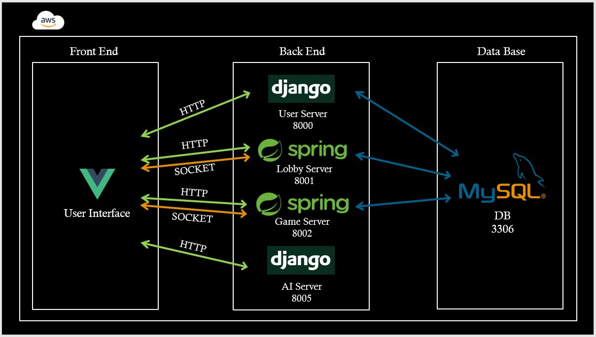
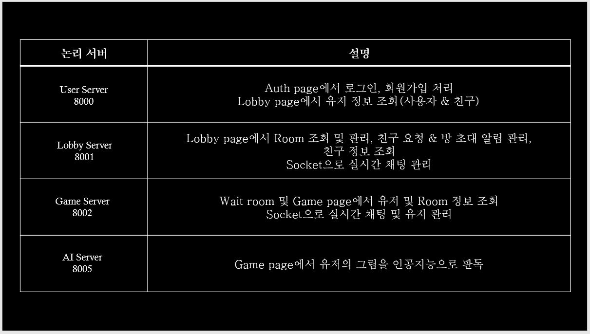
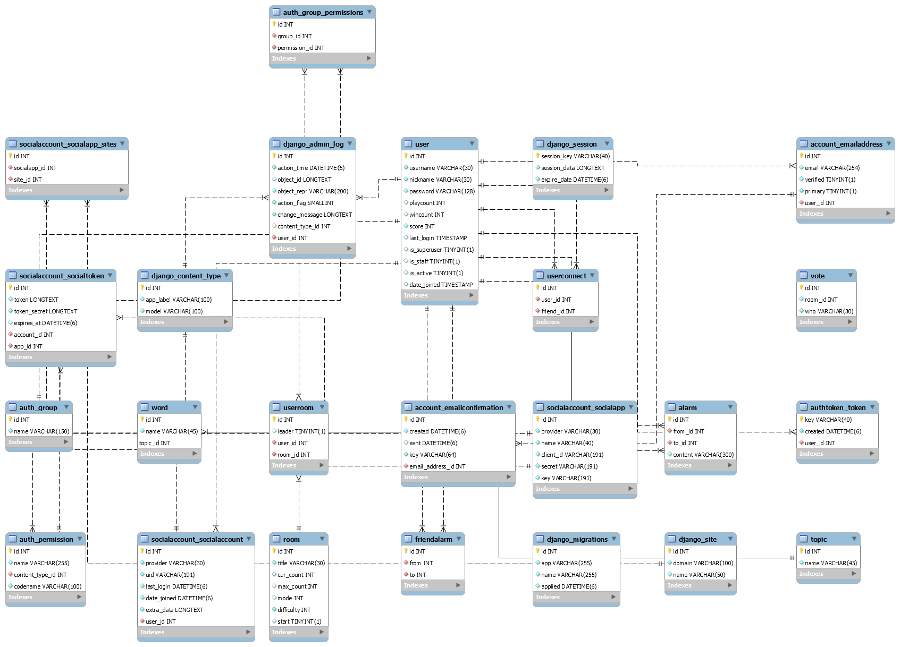
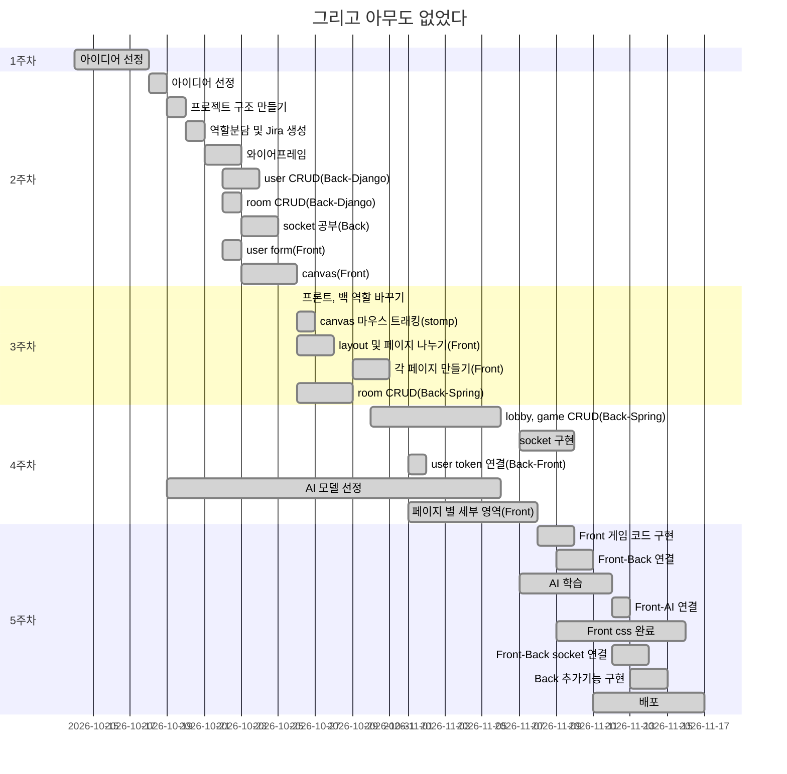

# README

                      


## '그리고 아무도 없었다' 개요

> '그리고 아무도 없었다'는 비언어적으로 소통하며 교류할 수 있는 파티게임입니다.

- **'코로나 블루'**

  최근 코로나 사태로 바깥 생활이 줄어들면서 사람들과 교류할 기회가 많이 줄어들었습니다.  혹시 '코로나 블루'라는 용어를 들어보셨나요?  '코로나 블루'란, 코로나19 사태 이후 감염에 대한 불안과 무거운 사회 분위기 때문에 겪는 우울감 또는 불안감을 의미합니다.  한국건강증진개발원에서  전국 만 20세~65세 이하의 성인 남녀 1,031명을 대상으로 '코로나19로 인한 건강상태'를 조사한 결과 전체 응답자의 40.7%가 '코로나 블루'를 경험했다고 합니다.  '코로나 블루'를 경험한 응답자의 경우, '코로나 블루'의 원인으로, '외출 및 모임 자제로 인한 사회적 고립감'을 선택한 비율이 32.1%로 가장 높았습니다. 

- **게임 업계의 호황**

  WHO(세계보건기구)가 코로나19의 세계적 유행에 게임 플레이를 권장할 정도로, 코로나19사태와 이로 인한 정신적 우울감의 여파가 극심하다는 사실을 알 수 있습니다. 이 때문인지 최근 게임 업계는 굉장히 호황을 이루고 있습니다.  문화체육관광부와 한국콘텐츠진흥원에서 발간한 '2020 게임이용자 실태조사' 보고서에 따르면 2020년 1월 이전 게임 이용 경험이 있는 이용자를 대상으로 코로나19로 게임 이용 행태에 변화가 있는지 파악했고, 그 결과 코로나19 이후 게임 이용 시간이 증가했다는 응답이 많았다는 사실을 알 수 있습니다. 이를 입증하듯 여러 게임업체의 매출이 전반적으로 급상승하는 현상을  보이고있고, 그중에서도 특히 '네오위즈'의 경우 전년 동기 대비 당기 순이익 403% 상승이라는 기록을 달성했다는 사실을 통해서 게임 업계가 호황기에 있다는 사실을 객관적으로 확인할 수 있습니다.

- **'그리고 아무도 없었다.'**

  이렇게 게임 시장이 주목받고 있는 가운데 저희는 다른 사람들과 비언어적으로 소통할 수 있는 새로운 게임을 제안하고자 합니다. 

  자세한 게임 설명은 아래의 게임 룰을 참고 바랍니다. 

  - [GameRule (클릭 시 이동)](./output/document/GameRule.md)

  다시 그때로 돌아갈 수는 없지만, 비언어적으로 마음과 마음이 연결되는 경험을 통해 사회적 고립감이 만연한 일상에 위로가 되었으면 좋겠습니다. 

- 출처

  [1] [한국건강증진개발원](https://www.khealth.or.kr/) 보도자료

  [2] https://www.sedaily.com/NewsVIew/1Z6HKWX4WI

### Why 그리고 아무도 없었다

> 게임의 설정 상 Shadow가 탐정들에게 걸리지 않는 이상 마지막에 Shadow의 정체를 밝히지 않습니다. 그렇기 때문에 결과적으로 마지막엔 아무도 남지 않는다라는 의미로 그리고 아무도 없었다라는 이름으로 탄생하게 되었습니다.


## Install

> 기본 및 이외 설정은 [settings](./output/document/settings.md)를 참고하세요


## Project Construction

> 해당 프로젝트는
>
> - BackEnd(`Spring` & `Django`)
> - FrontEnd(`Vue.js`)
> - DataBase(`Mysql`)
> - AI(`Tensorflow(Django)`)
>
> 로 총 **5개의 서버**로 구성되어 있습니다

```python
📦PJT
 ┣ 📂game-front				# FrontEnd
 ┃ ┣ 📂assets
 ┃ ┣ 📂public
 ┃ ┣ 📂src
 ┣ 📂gameBack				# UserServer(BackEnd/Django)
 ┃ ┣ 📂accounts						## 유저 계정 관련 App
 ┃ ┣ 📂gameBack						## UserServer setting
 ┣ 📂gamAI					# AIServer(BackEnd/Django)
 ┃ ┣ 📂detection					## AI detection 관련
 ┃ ┣ 📂gameAI						## UserServer setting
 ┃ ┣ 📂objects						## AI 처리해야할 objects 관련 App
 ┣ 📂gameBack_Lobby			# LobbyServer(BackEnd/spring)
 ┃ ┣ 📂src/main/java(이하생략)
 ┣ 📂gameBack_InGame		# InGameServer(BackEnd/spring)
 ┃ ┣ 📂src/main/java(이하생략)
 ┣ 📂outputs				# 산출물
 ┃ ┣ 📂Database						## DB 관련
 ┃ ┣ 📂Document						## 관련 문서
 ┃ ┣ 📂Images						## 관련 이미지파일
 ┗ 📜README.md				# 프로젝트 README
```


- 시스템 구성도

  

  

- 시스템 구성도 상세

  

  

- 각 서버의 구조는 해당 서버의 md 파일에서 확인할 수 있습니다.
  
  - [Frontend (클릭 시 이동)](./output/document/Frontend.md)
  - [UserServer (클릭 시 이동)](./output/document/UserServer.md)
  - [AIServer (클릭 시 이동)](./output/document/AIServer.md)
  - [InGameServer (클릭 시 이동)](./output/document/InGameServer.md)
  - [LobbyServer (클릭 시 이동)](./output/document/LobbyServer.md)
  
    
  
- 각 서버의 포트 번호

  | 서버         | 디렉토리명      | 포트번호 |
  | ------------ | --------------- | -------- |
  | UserServer   | gameBack        | 8000     |
  | LobbyServer  | gameBack_Lobby  | 8001     |
  | InGameServer | gameBack_InGame | 8002     |
  | AIServer     | gameAI          | 8005     |
  | DataBase     | -               | 3306     |


## Tech Stack

### :black_small_square: Tools

| Tool            | 기술                                                         |
| :-------------- | ------------------------------------------------------------ |
| GitLab          | 기능 별 branch를 나눠서 코드 버전 관리 (dev-`epic명`-`story명`) |
| Jira            | Issue 관리를 위해 Git과 연동하여 사용                        |
| Scrum Pocker    | Jira Issue 별 스프린트 시간 관리를 위한 어플리케이션         |
| VS Code         | `django` & `vue.js` 구현을 위한 tool                         |
| STS             | `Spring` 구현을 위한 tool                                    |
| Mysql workbench | `DataBase` 구현을 위한 tool                                  |
| Google Chrome   | 구현한 화면을 출력하기 위한 브라우저                         |

### :black_small_square: Library

| Library     | 내용                                                      |
| ----------- | --------------------------------------------------------- |
| Spring      | Backend 구현을 위한 java web framework (`Lobby`/`InGame`) |
| Django      | Backend 구현을 위한 python web framework (`User`/`AI`)    |
| Vue.js      | Frontend 구현을 위한 javascript web framework             |
| Tensor-flow | 이미지 처리(CNN)을 위한 Open Source 머신러닝 플랫폼       |
| Websocket   | Backend와 Frontend의 실시간 통신                          |
| Stomp       | 이미지 Canvas의 마우스 트래킹을 위한 소켓                 |
| axios       | Backend와 Frontend의 비동기 통신                          |

### :black_small_square: Software Language

| Language            | 기술                             |
| ------------------- | -------------------------------- |
| Java                | Backend 구현 언어                |
| Python              | Backend 및 이미지 처리 구현 언어 |
| JavaScript/HTML/CSS | Frontend 구현 언어               |
| SQL                 | DataBase 구현 언어               |


## Screen Configuration

> Main 화면 외 화면들은 [Screen](./output/document/Screen.md)를 참고하세요


### [Beta 홍보 영상 🎞️](https://youtu.be/dCh7_HpKsk4)


## 기술 설명

### ERD 



### Wire Frame

> [StoryBoard](./output/document/StoryBoard.md)를 참고하세요


##  Color 

> 게임의 컨셉이 `미스터리`인 관계 상 **검은색(Black)을 기준**으로 어두운 분위기의 **탁색**을 사용했습니다.
>
> 화면의 위에 올라가는 컴포넌트들은 **투명도를 적용**하여 배경이 비치도록 설정하여 은밀하게 보이는 듯한 효과를 주었습니다.


## Develop

### :black_small_square: Develop Period



### :black_small_square: Developer

- 조대흠[📧](conquerer1209@gmail.com): Backend(Spring), 서버 배포
- 박상현[📧](park03851@naver.com): Backend(Spring), Frontend
- 김호한[📧](ghgksdk123@naver.com): AI, Backend(Spring)
- 유수정[📧](yusj1231@gmail.com): Frontend, AI 서버(django) 구현, UCC
- 황신실[📧](ohgyosin@naver.com): Backend(Django), Frontend


## © Copyright 

해당 프로젝트는 삼성 소프트웨어 아카데미(SSAFY)를 통해 진행되었습니다.  해당 기관의 동의없이 해당 프로젝트를 임의로 재배포할 수 없습니다.