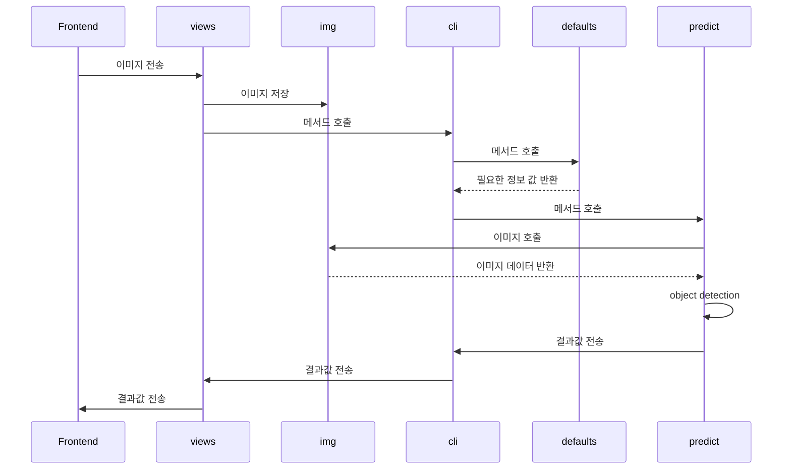

# AIServer

    

> AIServer는 `Frontend(PlayGame.vue)`와  `axios`를 사용해 통신합니다. 
>
> (다른 Backend 서버들과 직접적으로 통신하지 않습니다.)
>
> AIServer는 Tensor-flow를 사용하여 python으로 구성되었기에 `Django`로 구현되었습니다.
>
> Frontend에서 넘긴 이미지 파일을 object Detection하여 이미지와 매칭되는 이름들을 return합니다.


## AIServer Construction

```python
📦gameAI
 ┣ 📂detection
 ┃ ┣ 📂build
 ┃ ┃ ┣ 📂lib.win-amd64-3.7
 ┃ ┃ ┃ ┗ 📂darkflow
 ┃ ┃ ┃ ┃ ┗ 📂cython_utils
 ┃ ┃ ┃ ┃ ┃ ┣ 📜cy_yolo2_findboxes.cp37-win_amd64.pyd
 ┃ ┃ ┃ ┃ ┃ ┣ 📜cy_yolo_findboxes.cp37-win_amd64.pyd
 ┃ ┃ ┃ ┃ ┃ ┗ 📜nms.cp37-win_amd64.pyd
 ┃ ┃ ┗ 📂temp.win-amd64-3.7
 ┃ ┃ ┃ ┗ 📂Release
 ┃ ┃ ┃ ┃ ┗ 📂darkflow
 ┃ ┃ ┃ ┃ ┃ ┗ 📂cython_utils
 ┃ ┃ ┃ ┃ ┃ ┃ ┣ 📜cy_yolo2_findboxes.cp37-win_amd64.exp
 ┃ ┃ ┃ ┃ ┃ ┃ ┣ 📜cy_yolo2_findboxes.cp37-win_amd64.lib
 ┃ ┃ ┃ ┃ ┃ ┃ ┣ 📜cy_yolo2_findboxes.obj
 ┃ ┃ ┃ ┃ ┃ ┃ ┣ 📜cy_yolo_findboxes.cp37-win_amd64.exp
 ┃ ┃ ┃ ┃ ┃ ┃ ┣ 📜cy_yolo_findboxes.cp37-win_amd64.lib
 ┃ ┃ ┃ ┃ ┃ ┃ ┣ 📜cy_yolo_findboxes.obj
 ┃ ┃ ┃ ┃ ┃ ┃ ┣ 📜nms.cp37-win_amd64.exp
 ┃ ┃ ┃ ┃ ┃ ┃ ┣ 📜nms.cp37-win_amd64.lib
 ┃ ┃ ┃ ┃ ┃ ┃ ┗ 📜nms.obj
 ┃ ┣ 📂cfg
 ┃ ┃ ┣ 📜my-tiny-yolo.cfg
 ┃ ┣ 📂ckpt
 ┃ ┃ ┣ 📜checkpoint
 ┃ ┃ ┣ 📜my-tiny-yolo-37200.data-00000-of-00001
 ┃ ┃ ┣ 📜my-tiny-yolo-37200.index
 ┃ ┃ ┣ 📜my-tiny-yolo-37200.meta
 ┃ ┃ ┗ 📜my-tiny-yolo-37200.profile
 ┃ ┣ 📂darkflow
 ┃ ┃ ┣ 📂cython_utils
 ┃ ┃ ┃ ┣ 📜cy_yolo2_findboxes.c
 ┃ ┃ ┃ ┣ 📜cy_yolo2_findboxes.cp37-win_amd64.pyd
 ┃ ┃ ┃ ┣ 📜cy_yolo2_findboxes.pyx
 ┃ ┃ ┃ ┣ 📜cy_yolo_findboxes.c
 ┃ ┃ ┃ ┣ 📜cy_yolo_findboxes.cp37-win_amd64.pyd
 ┃ ┃ ┃ ┣ 📜cy_yolo_findboxes.pyx
 ┃ ┃ ┃ ┣ 📜nms.c
 ┃ ┃ ┃ ┣ 📜nms.cp37-win_amd64.pyd
 ┃ ┃ ┃ ┣ 📜nms.pxd
 ┃ ┃ ┃ ┣ 📜nms.pyx
 ┃ ┃ ┃ ┗ 📜__init__.py
 ┃ ┃ ┣ 📂dark
 ┃ ┃ ┃ ┣ 📜connected.py
 ┃ ┃ ┃ ┣ 📜convolution.py
 ┃ ┃ ┃ ┣ 📜darknet.py
 ┃ ┃ ┃ ┣ 📜darkop.py
 ┃ ┃ ┃ ┣ 📜layer.py
 ┃ ┃ ┃ ┗ 📜__init__.py
 ┃ ┃ ┣ 📂net
 ┃ ┃ ┃ ┣ 📂mnist
 ┃ ┃ ┃ ┃ ┗ 📜run.py
 ┃ ┃ ┃ ┣ 📂ops
 ┃ ┃ ┃ ┃ ┣ 📜baseop.py
 ┃ ┃ ┃ ┃ ┣ 📜convolution.py
 ┃ ┃ ┃ ┃ ┣ 📜simple.py
 ┃ ┃ ┃ ┃ ┗ 📜__init__.py
 ┃ ┃ ┃ ┣ 📂vanilla
 ┃ ┃ ┃ ┃ ┣ 📜train.py
 ┃ ┃ ┃ ┃ ┗ 📜__init__.py
 ┃ ┃ ┃ ┣ 📂yolov2
 ┃ ┃ ┃ ┃ ┣ 📜data.py
 ┃ ┃ ┃ ┃ ┣ 📜predict.py
 ┃ ┃ ┃ ┃ ┣ 📜train.py
 ┃ ┃ ┃ ┃ ┗ 📜__init__.py
 ┃ ┃ ┃ ┣ 📜build.py
 ┃ ┃ ┃ ┣ 📜flow.py
 ┃ ┃ ┃ ┣ 📜framework.py
 ┃ ┃ ┃ ┣ 📜help.py
 ┃ ┃ ┃ ┗ 📜__init__.py
 ┃ ┃ ┣ 📂utils
 ┃ ┣ 📂img
 ┃ ┣ 📂logs
 ┃ ┣ 📂logstrain
 ┃ ┣ 📜.coveragerc
 ┃ ┣ 📜.gitignore
 ┃ ┣ 📜.travis.yml
 ┃ ┣ 📜demo.gif
 ┃ ┣ 📜flow
 ┃ ┣ 📜labels.txt
 ┃ ┣ 📜LICENSE
 ┃ ┣ 📜preview.png
 ┃ ┣ 📜README.md
 ┃ ┗ 📜setup.py
 ┣ 📂gameAI					# AIServer setting 디렉토리
 ┃ ┣ 📜settings.py
 ┃ ┣ 📜urls.py
 ┃ ┣ 📜wsgi.py
 ┃ ┗ 📜__init__.py
 ┣ 📂objects				# objects 관련 APP
 ┃ ┣ 📜apps.py
 ┃ ┣ 📜urls.py
 ┃ ┣ 📜views.py
 ┃ ┗ 📜__init__.py
 ┗ 📜manage.py
```


## Sequence Diagram

### :black_small_square: Object Detection

> 받아온 이미지의 Object Detection 과정의 Diagram



| 이름                         | 역할                                                         | 위치                                            |
| ---------------------------- | ------------------------------------------------------------ | ----------------------------------------------- |
| Frontend(`PlayGame`)         | AI 처리할 이미지 전송                                        | views/game/PlayGame.vue                         |
| views(`imgdetection` 메서드) | 받은 이미지를 저장하고 AI 처리를 위한 메서드를 호출하여 결과값을 받아와서 Frontend로 결과 값을 전송 | gameAI/objects/views.py                         |
| img                          | 받아온 이미지를 저장하는 디렉토리                            | gameAI/detection/img                            |
| cli                          | 필요한 정보값이 들어있는 메서드를 실행하고 AI 예측을 위한 predict 메서드를 호출하여 결과 값을 받아 views.py로 넘겨줌 | gameAI/detection/darkflow/cli.py                |
| defaults                     | 메서드 실행에 필요한 정보값들을 정의해둔 모듈                | gameAI/detection/darkflow/defaults.py           |
| predict                      | 학습된 AI 모델을 사용하여 받아온 이미지를 object detection 하여 이미지 별로 결과값을 받아 cli로 넘겨줌 | gameAI/detection/darkflow/net/yolov2/predict.py |


## Using Library

- tensor-flow
- cython 37
- Yolo v2
- mnist