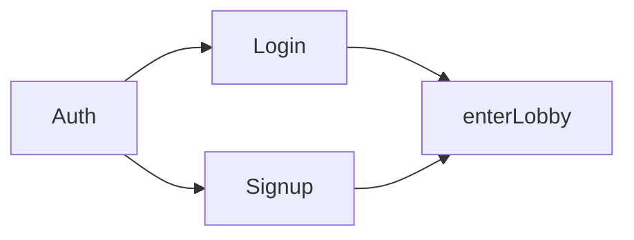
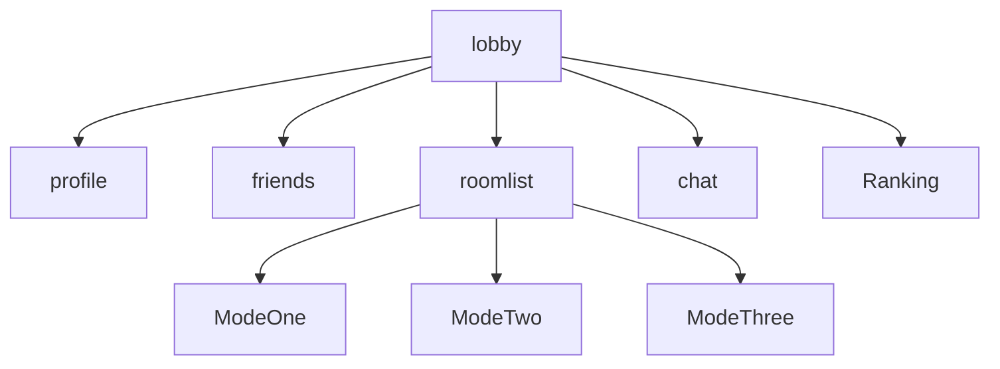
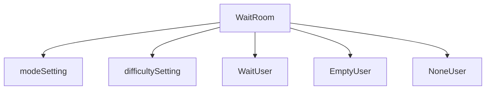
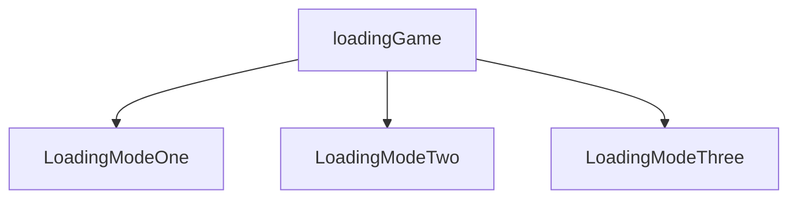
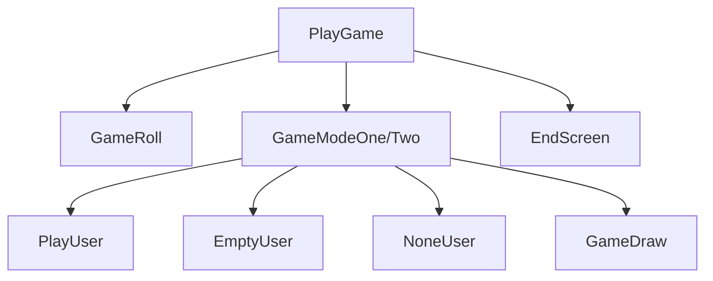
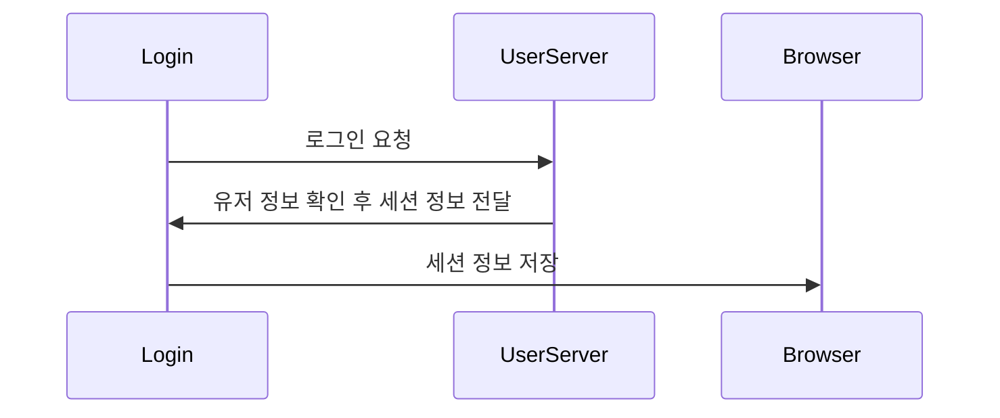
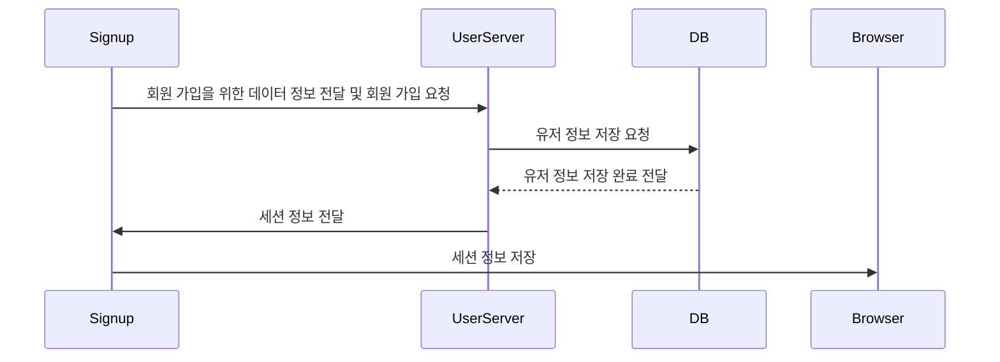
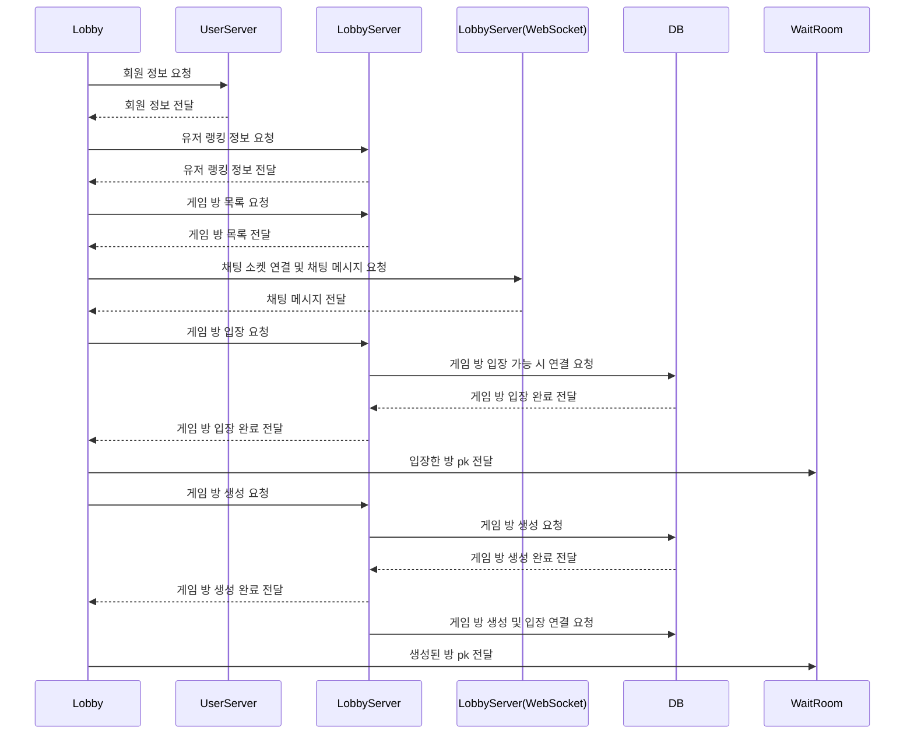
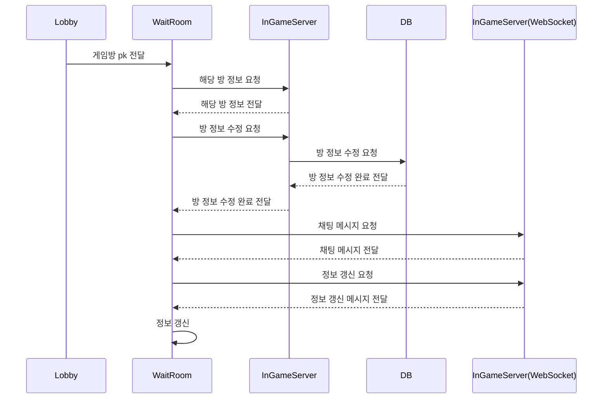
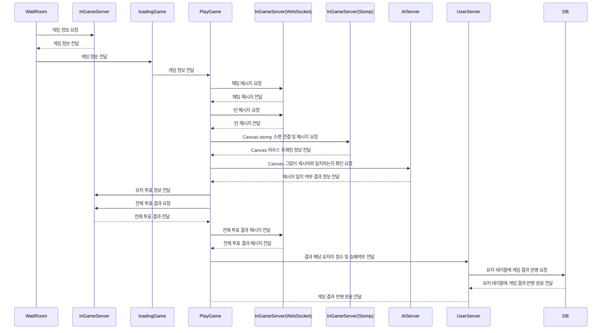

# Frontend  

    

> FrontEnd `Vue.js`로 구현되었습니다. (해당 프로젝트는 `vue cli`를 사용해 구축되었습니다.)
>
> BackEnd 및 AI와 `axios`와 `socket`을 사용하여 통신합니다.


## Frontend Construction

```python
📦game-front
 ┣ 📂public						# 전체 index와 favicon
 ┃ ┣ 📜favi.ico
 ┃ ┗ 📜index.html
 ┣ 📂src
 ┃ ┣ 📂assets					# Image, music 등 frontend에서 사용하는 데이터들을 위한 디렉토리
 ┃ ┃ ┣ 📂css
 ┃ ┃ ┣ 📂images
 ┃ ┃ ┗ 📂musics
 ┃ ┣ 📂components				# 각 페이지 하위 컴포넌트
 ┃ ┃ ┣ 📂game						## 게임이 실행되는 PlayGame.vue 하위 컴포넌트
 ┃ ┃ ┃ ┣ 📜EmptyUser.vue
 ┃ ┃ ┃ ┣ 📜EndScreen.vue
 ┃ ┃ ┃ ┣ 📜GameDraw.vue
 ┃ ┃ ┃ ┣ 📜GameModeOne.vue
 ┃ ┃ ┃ ┣ 📜GameModeTwo.vue
 ┃ ┃ ┃ ┣ 📜GameRoll.vue
 ┃ ┃ ┃ ┣ 📜NoneUser.vue
 ┃ ┃ ┃ ┗ 📜PlayUser.vue
 ┃ ┃ ┣ 📂lobby						## 게임 접속 시 첫 화면인 Lobby.vue 하위 컴포넌트
 ┃ ┃ ┃ ┣ 📜chat.vue
 ┃ ┃ ┃ ┣ 📜friends.vue
 ┃ ┃ ┃ ┣ 📜ModeOne.vue
 ┃ ┃ ┃ ┣ 📜ModeThree.vue
 ┃ ┃ ┃ ┣ 📜ModeTwo.vue
 ┃ ┃ ┃ ┣ 📜profile.vue
 ┃ ┃ ┃ ┣ 📜Ranking.vue
 ┃ ┃ ┃ ┗ 📜roomlist.vue
 ┃ ┃ ┣ 📂room						## 게임 실행 직전 대기하는 WaitRoom.vue 하위 컴포넌트
 ┃ ┃ ┃ ┣ 📜difficultySetting.vue
 ┃ ┃ ┃ ┣ 📜EmptyUser.vue
 ┃ ┃ ┃ ┣ 📜LoadingModeOne.vue
 ┃ ┃ ┃ ┣ 📜LoadingModeThree.vue
 ┃ ┃ ┃ ┣ 📜LoadingModeTwo.vue
 ┃ ┃ ┃ ┣ 📜modeSetting.vue
 ┃ ┃ ┃ ┣ 📜NoneUser.vue
 ┃ ┃ ┃ ┗ 📜WaitUser.vue
 ┃ ┃ ┗ 📂user						## 유저(로그인 관련) 하위 컴포넌트
 ┃ ┃ ┃ ┗ 📜Logo.vue
 ┃ ┣ 📂util						# 각 포트 별 axios 요청을 위한 js 파일 디렉토리
 ┃ ┃ ┣ 📜http-ai.js
 ┃ ┃ ┣ 📜http-common.js
 ┃ ┃ ┣ 📜http-game.js
 ┃ ┃ ┗ 📜http-lobby.js
 ┃ ┣ 📂views					# frontend의 페이지가 될 컴포넌트들
 ┃ ┃ ┣ 📂forbidden					## 404 not found 관련 페이지	
 ┃ ┃ ┃ ┗ 📜forbidden404.vue
 ┃ ┃ ┣ 📂game						## 게임 실행 관련 페이지
 ┃ ┃ ┃ ┣ 📜loadingGame.vue
 ┃ ┃ ┃ ┣ 📜PlayGame.vue
 ┃ ┃ ┃ ┗ 📜WaitRoom.vue
 ┃ ┃ ┣ 📂lobby						## 게임 접속 시 첫 화면 페이지
 ┃ ┃ ┃ ┗ 📜lobby.vue
 ┃ ┃ ┗ 📂user						## 로그인, 회원가입 등 유저 관련 페이지
 ┃ ┃ ┃ ┣ 📜Auth.vue
 ┃ ┃ ┃ ┣ 📜enterLobby.vue
 ┃ ┃ ┃ ┣ 📜Login.vue
 ┃ ┃ ┃ ┗ 📜Signup.vue
 ┃ ┣ 📜App.vue
 ┃ ┣ 📜main.js
 ┃ ┗ 📜routes.js
 ┣ 📜babel.config.js
 ┣ 📜package-lock.json
 ┣ 📜package.json
```


## Components Diagram

### :black_small_square: Auth

> 게임 접속 시 처음 만나는 `Auth.vue`에서 실행되는 하위 컴포넌트의 구조를 그린 Diagram



| 파일         | 역할                           | 위치                      |
| ------------ | ------------------------------ | ------------------------- |
| `Auth`       | 메인 페이지                    | views/user/Auth.vue       |
| `Login`      | 로그인 컴포넌트                | views/user/Login.vue      |
| `Signup`     | 회원가입 컴포넌트              | views/user/Signup.vue     |
| `enterLobby` | 로비로 들어가기 전 로딩 페이지 | views/user/enterLobby.vue |


### :black_small_square: Lobby

> 게임 로그인 후 전체 로비 `Lobby.vue`에서 실행되는 하위 컴포넌트의 구조를 그린 Diagram



| 파일        | 역할                                              | 위치                           |
| ----------- | ------------------------------------------------- | ------------------------------ |
| `lobby`     | 로비 페이지의 최상단 컴포넌트                     | views/lobby/lobby.vue          |
| `profile`   | 유저 프로필 관련 컴포넌트                         | components/lobby/profile.vue   |
| `friends`   | 유저의 친구 목록을 가져오기 위한 컴포넌트         | components/lobby/friends.vue   |
| `roomlist`  | 게임 방 목록 출력 및 게임 방 생성을 위한 컴포넌트 | components/lobby/roomlist.vue  |
| `ModeOne`   | 게임 설명 - 자유그리기 모드 설명을 위한 컴포넌트  | components/lobby/ModeOne.vue   |
| `ModeTwo`   | 게임 설명 - 이어그리기 모드 설명을 위한 컴포넌트  | components/lobby/ModeTwo.vue   |
| `ModeThree` | 게임 설명 - AI점검중 모드 설명을 위한 컴포넌트    | components/lobby/ModeThree.vue |
| `chat`      | 로비 전체 채팅을 위한 컴포넌트                    | components/lobby/chat.vue      |
| `Ranking`   | 유저들의 랭킹들을 확인할 수 있는 컴포넌트         | components/lobby/Ranking.vue   |


### :black_small_square: WaitRoom

> 게임 대기 방 `WaitRoom.vue` 에서 실행되는 하위 컴포넌트의 구조를 그린 Diagram



| 파일                | 역할                                                         | 위치                                  |
| ------------------- | ------------------------------------------------------------ | ------------------------------------- |
| `WaitRoom`          | 게임 대기방 최상단 컴포넌트                                  | views/game/WaitRoom.vue               |
| `modeSetting`       | 게임 대기방의 **게임 모드** 관련 컴포넌트                    | components/room/modeSetting.vue       |
| `difficultySetting` | 게임 대기방의 **난이도** 관련 컴포넌트                       | components/room/difficultySetting.vue |
| `WaitUser`          | 게임 대기방에 **접속한 유저** 컴포넌트                       | components/room/WaitUser.vue          |
| `EmptyUser`         | 게임 대기방의 열린 유저 칸 중, 유저가 들어오지 않아 비어있는 칸을 출력하기 위한 컴포넌트 | components/room/EmptyUser.vue         |
| `NoneUser`          | 게임 대기방의 최대 칸 8칸 중, 열리지 않은 유저 칸을 출력하기 위한 컴포넌트 | components/room/NoneUser.vue          |


### :black_small_square: loadingGame

> 게임 대기 방에서 게임 실행으로 넘어가기 전 로딩 화면인 `loadingGame.vue` 에서 실행되는 하위 컴포넌트의 구조를 그린 Diagram



| 파일               | 역할                                                | 위치                                 |
| ------------------ | --------------------------------------------------- | ------------------------------------ |
| `loadingGame`      | 로딩 페이지의 최상단 컴포넌트                       | views/game/loadingGame.vue           |
| `LoadingModeOne`   | 게임의 모드가 **자유그리기**일 때 출력되는 컴포넌트 | components/room/LoadingModeOne.vue   |
| `LoadingModeTwo`   | 게임의 모드가 **이어그리기**일 때 출력되는 컴포넌트 | components/room/LoadingModeTwo.vue   |
| `LoadingModeThree` | 게임의 모드가 **AI점검중**일 때 출력되는 컴포넌트   | components/room/LoadingModeThree.vue |


### :black_small_square: PlayGame

> 게임 시작 후, `PlayGame.vue` 에서 실행되는 하위 컴포넌트의 구조를 그린 Diagram



| 파일          | 역할                                                         | 위치                            |
| ------------- | ------------------------------------------------------------ | ------------------------------- |
| `PlayGame`    | 게임 실행 페이지의 최상단 컴포넌트                           | views/game/PlayGame.vue         |
| `GameRoll`    | 게임 실행 시 제일 처음, 제시어 확인을 위한 컴포넌트          | components/game/GameRoll.vue    |
| `GameModeOne` | 게임 모드 중 **자유그리기와 AI점검중**의 화면 레이아웃 구성하는 컴포넌트 | components/game/GameModeOne.vue |
| `GameModeTwo` | 게임 모드 중 **이어그리기**의 화면 레이아웃을 구성하는 컴포넌트 | components/game/GameModeTwo.vue |
| `PlayUser`    | 현재 진행 중인 게임 방에 **참가하는 유저**를 출력하기 위한 컴포넌트 | components/game/PlayUser.vue    |
| `EmptyUser`   | 현재 진행 중인 게임 방의 열린 유저 칸 중, 유저가 들어오지 않아 비어있는 칸을 출력하기 위한 컴포넌트 | components/game/EmptyUser.vue   |
| `NoneUser`    | 현재 진행 중인 게임 방의 최대 칸 8칸 중 열리지 않은 칸을 출력하기 위한 컴포넌트 | components/game/NoneUser.vue    |
| `GameDraw`    | 게임을 위한 Canvas 관련 컴포넌트                             | components/game/GameDraw.vue    |
| `EndScreen`   | **게임의 모든 턴이 종료**한 후, 투표 및 결과 출력을 위한 컴포넌트 | components/game/EndScreen.vue   |


## Sequence Diagram

### :black_small_square: Login

> 로그인 페이지에서 실행되는 sequence diagram



| 이름         | 위치               | 역할                                                         | 포트번호 |
| ------------ | ------------------ | ------------------------------------------------------------ | -------- |
| `Login`      | Frontend           | 해당 diagram이 일어나는 로그인 페이지                        | -        |
| `UserServer` | gameBack(`Django`) | 유저 관련 Backend로 로그인, 회원가입 등 User 테이블에 관련된 로직을 실행 | 8000     |


### :black_small_square: Signup

> 회원가입 페이지에서 실행되는 sequence diagram



| 이름         | 위치               | 역할                                                         | 포트번호 |
| ------------ | ------------------ | ------------------------------------------------------------ | -------- |
| `Signup`     | Frontend           | 해당 diagram이 일어나는 회원가입 페이지                      | -        |
| `UserServer` | gameBack(`Django`) | 유저 관련 Backend로 로그인, 회원가입 등 User 테이블에 관련된 로직을 실행 | 8000     |
| `DB`         | DataBase           | 전체 DataBase                                                | 3306     |


### :black_small_square: Lobby

> 로비 페이지에서 실행되는 sequence diagram



| 이름                                | 위치                     | 역할                                | 포트번호/주소 |
| ----------------------------------- | ------------------------ | ----------------------------------- | ------------- |
| `Lobby`                             | Frontend                 | 해당 diagram이 일어나는 로비 페이지 | -             |
| `UserServer`                        | gameBack(`Django`)       | 유저 관련 Backend                   | 8000(port)    |
| `LobbyServer`                       | gameBack_Lobby(`Spring`) | 게임 로비 Backend                   | 8001(port)    |
| LobbyServer(WebSocket) - `Chatting` | gameBack_Lobby(`Spring`) | 로비 Chatting 소켓                  | /chatting     |
| `DB`                                | DataBase                 | 전체 DataBase                       | 3306          |
| `WaitRoom`                          | Frontend                 | 게임 대기 방 페이지                 | -             |


### :black_small_square: Wait a game

> 게임 대기 방에서 실행되는 sequence diagram



| 이름                                  | 위치                       | 역할                                                         | 포트번호/주소 |
| ------------------------------------- | -------------------------- | ------------------------------------------------------------ | ------------- |
| `Lobby`                               | Frontend                   | 로비 페이지                                                  | -             |
| `WaitRoom`                            | Frontend                   | 해당 diagram이 일어나는 게임 대기방 페이지                   | -             |
| `InGameServer`                        | gameBack_InGame (`Spring`) | 게임 플레이 관련 BackEnd                                     | 8002(port)    |
| InGameServer(WebSocket) - `Chatting`  | gameBack_InGame (`Spring`) | 게임 대기 방 Chatting 소켓                                   | /chatting     |
| InGameServer(WebSocket) -  `Renewing` | gameBack_InGame (`Spring`) | 게임 대기 방에서는 방정보 갱신 관련 소켓, 유저가 들어오고 나가는 것과 팀장 위임, 모드 수정 등의 경우 정보 요청 및 전달 | /renewing     |
| `DB`                                  | DataBase                   | 전체 Database                                                | 3306          |


### :black_small_square: Play a game

> 게임 대기 방에서 플레이 시작 후, 실행되는 sequence diagram



| 이름                                 | 위치                       | 역할                                                         | 포트번호/주소 |
| ------------------------------------ | -------------------------- | ------------------------------------------------------------ | ------------- |
| `WaitRoom`                           | Frontend                   | 게임 대기방 페이지                                           | -             |
| `loadingGame`                        | Frontend                   | 게임 시작 전 로딩 페이지                                     | -             |
| `PlayGame`                           | Frontend                   | 해당 diagram이 일어나는 게임 플레이 페이지                   | -             |
| `InGameServer`                       | gameBack_InGame (`Spring`) | 게임 플레이 관련 BackEnd                                     | 8002(port)    |
| InGameServer(WebSocket) - `Chatting` | gameBack_InGame (`Spring`) | 게임 플레이 시 Chatting 소켓                                 | /chatting     |
| InGameServer(WebSocket) -  `Play`    | gameBack_InGame (`Spring`) | 게임 플레이 시 게임의 Play 관련 소켓, 해당 부분에서는 Turn 및 투표 결과 전달로 사용 | /renewing     |
| `AIServer`                           | gameAI(`Django`)           | AI (어떤 그림을 그린 것인지 판단 후 결과 전달)               | 8005(port)    |
| `DB`                                 | DataBase                   | 전체 Database                                                | 3306          |


## Code

### Socket 연결 코드 (ex. Chatting)

```vue
<template>
	<div><div class="chat__part">
            <div class="chatting__area">
                <div class="scrollbar-box" id="scrollbar__style" >
                    <div class="force-overflow" >
                        <br v-for="n in 27" :key="n + 'chatBRKey'"/>
                        <div v-for="(log, index) in chatLogs" class="log" :key="index + 'chatLogKey'">
                            <strong style="margin-left: 5px;">{{ log.event }}</strong>: <span style="color: rgb(201, 201, 201);">{{ log.data }}</span>
                        </div>
                        <br/>
                    </div>
                </div>
            </div>
            <div class="input-group">
                <select class="custom-select" id="inputMessageSelect" aria-label="Select Chat phrases" style="background-color: rgba(255, 255, 255, 0.3); color: white; border: none;">
                    <option selected style="color:black;">채팅 문구 선택</option>
                    <option v-for="(chat, index) in chatList" :value="index" :key="chat + 'chatkey'" style="color:black;">{{ chat }}</option>
                </select>
                <div class="input-group-append">
                    <div class="btn btn-outline-secondary" type="button" @click="chatMessage">Enter</div>
                </div>
            </div>
        </div>
    </div>
</template>

<script>
    
    data() {
        return {
            // 소켓, 채팅 메시지
            chatMsg: '',
            chatLogs: [],
            socket: null,
        }
    },
        
    

    created() {
    	this.connect();	   
    },
        
    destroyed() {
        this.socket.close();
        this.socketPlay.close();
        this.audioBtn.pause();
    },
        
    methods: {
        
        // 채팅 부분
        // 소켓 연결
        connect() {
            this.socket = new WebSocket(`${socketURL}/${this.game.id}`);
            this.socket.onopen = () => {
                
                this.socket.onmessage = ({data}) => {
                    this.chatLogs.push(JSON.parse(data));
                    const chatBox = document.querySelector(".scrollbar-box");
                    chatBox.scrollTop = chatBox.scrollHeight;
                };
            };
        },

        // 채팅 버튼
        chatMessage() {
            var s = document.getElementById("inputMessageSelect");
            var idx = s.options[s.selectedIndex].value;
            if (this.chatList[idx] === undefined) {
                alert('메시지를 선택해주세요');
            } else {
                this.socket.send(JSON.stringify({ event: this.myNickname, data: this.chatList[idx], room_id: this.game.id }));
            }
        },
    }
</script>
```


### Session 사용 시 로그인 확인 후 돌리는 코드

```javascript
import Auth from './views/user/Auth.vue'

// 로그인이 필요한 경우엔 requireAuth 를 사용한다. beforeEnter: requireAuth()
const requireAuth = () => (to, from, next) => {
    let id = window.sessionStorage.getItem('id');
    let token = window.sessionStorage.getItem('token');

    if(id && token) {
        return next();
    } else {
        window.sessionStorage.clear();
        return next('/');
    }
};

// 이미 로그인을 한 경우에는 getAuth 를 사용한다. beforeEnter: getAuth()
const getAuth = () => (to, from, next) => {
    let id = window.sessionStorage.getItem('id');
    let token = window.sessionStorage.getItem('token');

    if(id && token) {
        return next('/lobby');
    } else {
        window.sessionStorage.clear();
        return next();
    }
};


export default [
    // test
    {
        path : '/',
        name : 'Auth',
        component : Auth,
        beforeEnter: getAuth()
    },
]
```


### 하위 컴포넌트 메서드 호출하기(ref)

```vue
<template>
    <div id="PlayGame">
        <div v-if="isMode">
            <ModeOne @imgFile="sendAI" ref="modeOne" />
        </div>
    </div>
</template>

<script>
	methods: {
        this.$refs.modeOne.$refs.draw.resetCanvas();
    }
</script>
```

- 해당 컴포넌트에 `ref = {호출할 이름}` 을 건 후에 `this.$refs.{호출할 이름}.{해당 컴포넌트 메서드명}()`으로 호출할 수 있다.


### 하위 컴포넌트에서 상위 컴포넌트로 올리기(emit)

```vue
<!-- 상위 컴포넌트의 template-->
<template>
    <div id="PlayGame">
        <div v-if="isMode">
            <ModeOne @imgFile="sendAI" ref="modeOne" />
        </div>
    </div>
</template>
```

```vue
<!-- 하위 컴포넌트-->
<script>
    methods: {
		imgFile(image) {
    		this.$emit('imgFile', image);
		},
    }
</script>
```

