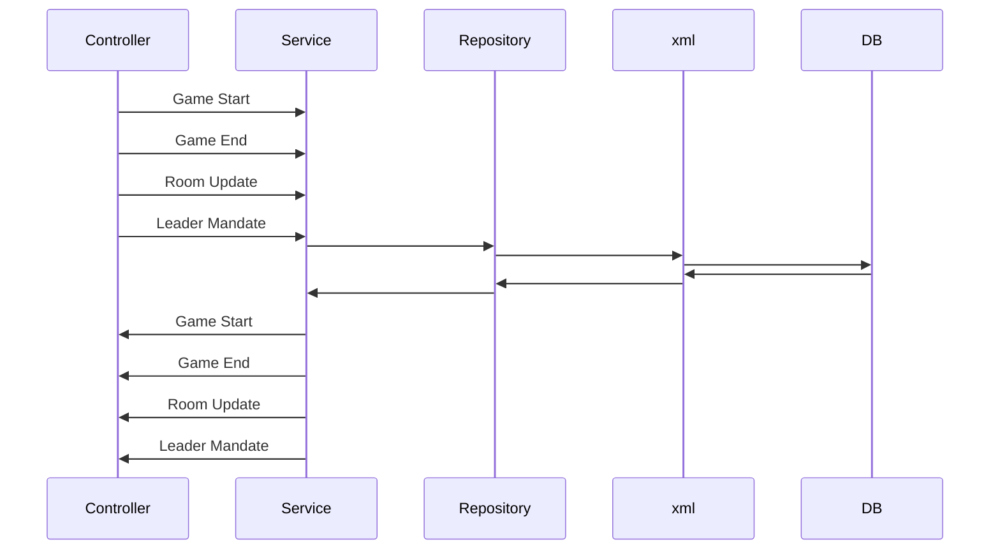
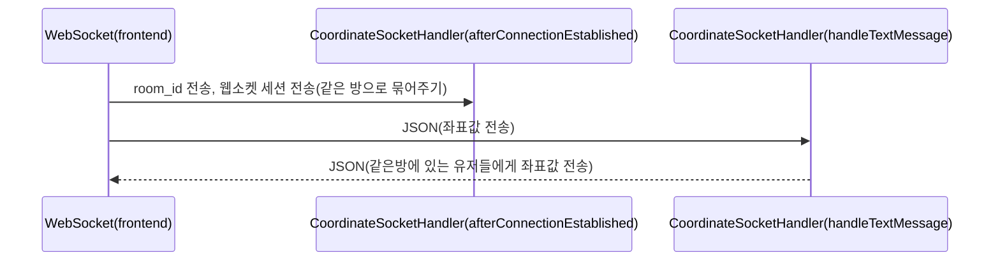
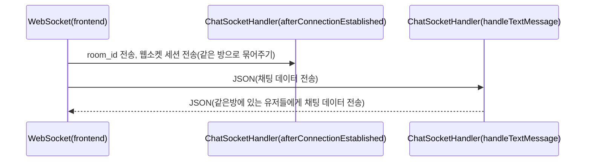
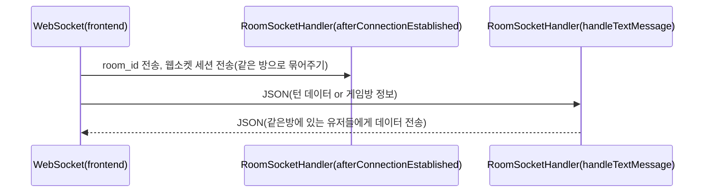

# InGameServer

  

>InGameServer는 `Frontend`와 `axios`와 `socket`을 사용해 통신합니다.
>
>InGameServer는 Java 언어를 사용해 `Spring`으로 구현되었습니다.
>
>`Frontend`의 `WaitRoom.vue`와 `PlayGame.vue`에서 각각 socket 2개, 3개로 연결되어있습니다.


## InGameServer Construction

```python
📦gameBack_InGame
 ┣ 📂.mvn
 ┃ ┗ 📂wrapper
 ┃ ┃ ┣ 📜maven-wrapper.jar
 ┃ ┃ ┣ 📜maven-wrapper.properties
 ┃ ┃ ┗ 📜MavenWrapperDownloader.java
 ┣ 📂.settings
 ┃ ┣ 📜org.eclipse.core.resources.prefs
 ┃ ┣ 📜org.eclipse.jdt.core.prefs
 ┃ ┣ 📜org.eclipse.wst.common.project.facet.core.xml
 ┃ ┗ 📜org.springframework.ide.eclipse.prefs
 ┣ 📂src
 ┃ ┣ 📂main
 ┃ ┃ ┣ 📂java
 ┃ ┃ ┃ ┗ 📂com
 ┃ ┃ ┃ ┃ ┗ 📂ssafy
 ┃ ┃ ┃ ┃ ┃ ┗ 📂pjt3
 ┃ ┃ ┃ ┃ ┃ ┃ ┣ 📂config
 ┃ ┃ ┃ ┃ ┃ ┃ ┃ ┣ 📜SwaggerConfig.java
 ┃ ┃ ┃ ┃ ┃ ┃ ┃ ┗ 📜WebSocketConfig.java
 ┃ ┃ ┃ ┃ ┃ ┃ ┣ 📂controller
 ┃ ┃ ┃ ┃ ┃ ┃ ┃ ┣ 📜DrawController.java
 ┃ ┃ ┃ ┃ ┃ ┃ ┃ ┣ 📜GameController.java
 ┃ ┃ ┃ ┃ ┃ ┃ ┃ ┗ 📜VoteController.java
 ┃ ┃ ┃ ┃ ┃ ┃ ┣ 📂dao
 ┃ ┃ ┃ ┃ ┃ ┃ ┃ ┣ 📜GameDao.java
 ┃ ┃ ┃ ┃ ┃ ┃ ┃ ┣ 📜GameDaoImpl.java
 ┃ ┃ ┃ ┃ ┃ ┃ ┃ ┣ 📜RoomDao.java
 ┃ ┃ ┃ ┃ ┃ ┃ ┃ ┣ 📜RoomDaoImpl.java
 ┃ ┃ ┃ ┃ ┃ ┃ ┃ ┣ 📜UserDao.java
 ┃ ┃ ┃ ┃ ┃ ┃ ┃ ┣ 📜UserDaoImpl.java
 ┃ ┃ ┃ ┃ ┃ ┃ ┃ ┣ 📜VoteDao.java
 ┃ ┃ ┃ ┃ ┃ ┃ ┃ ┗ 📜VoteDaoImpl.java
 ┃ ┃ ┃ ┃ ┃ ┃ ┣ 📂dto
 ┃ ┃ ┃ ┃ ┃ ┃ ┃ ┣ 📜Room.java
 ┃ ┃ ┃ ┃ ┃ ┃ ┃ ┣ 📜Topic.java
 ┃ ┃ ┃ ┃ ┃ ┃ ┃ ┣ 📜User.java
 ┃ ┃ ┃ ┃ ┃ ┃ ┃ ┣ 📜UserRoom.java
 ┃ ┃ ┃ ┃ ┃ ┃ ┃ ┗ 📜Vote.java
 ┃ ┃ ┃ ┃ ┃ ┃ ┣ 📂handler
 ┃ ┃ ┃ ┃ ┃ ┃ ┃ ┣ 📜ChatSocketHandler.java
 ┃ ┃ ┃ ┃ ┃ ┃ ┃ ┣ 📜CoordinateSocketHandler.java
 ┃ ┃ ┃ ┃ ┃ ┃ ┃ ┗ 📜RoomSocketHandler.java
 ┃ ┃ ┃ ┃ ┃ ┃ ┣ 📂model
 ┃ ┃ ┃ ┃ ┃ ┃ ┃ ┣ 📜BasicResponse.java
 ┃ ┃ ┃ ┃ ┃ ┃ ┃ ┣ 📜ChatMessage.java
 ┃ ┃ ┃ ┃ ┃ ┃ ┃ ┣ 📜DrawMessage.java
 ┃ ┃ ┃ ┃ ┃ ┃ ┃ ┣ 📜GameData.java
 ┃ ┃ ┃ ┃ ┃ ┃ ┃ ┣ 📜point.java
 ┃ ┃ ┃ ┃ ┃ ┃ ┃ ┣ 📜ServiceMessage.java
 ┃ ┃ ┃ ┃ ┃ ┃ ┃ ┣ 📜UserData.java
 ┃ ┃ ┃ ┃ ┃ ┃ ┃ ┣ 📜VoteData.java
 ┃ ┃ ┃ ┃ ┃ ┃ ┃ ┗ 📜WaitRoomData.java
 ┃ ┃ ┃ ┃ ┃ ┃ ┣ 📂service
 ┃ ┃ ┃ ┃ ┃ ┃ ┃ ┣ 📜GameService.java
 ┃ ┃ ┃ ┃ ┃ ┃ ┃ ┣ 📜GameServiceImpl.java
 ┃ ┃ ┃ ┃ ┃ ┃ ┃ ┣ 📜RoomService.java
 ┃ ┃ ┃ ┃ ┃ ┃ ┃ ┣ 📜RoomServiceImpl.java
 ┃ ┃ ┃ ┃ ┃ ┃ ┃ ┣ 📜UserService.java
 ┃ ┃ ┃ ┃ ┃ ┃ ┃ ┣ 📜UserServiceImpl.java
 ┃ ┃ ┃ ┃ ┃ ┃ ┃ ┣ 📜VoteService.java
 ┃ ┃ ┃ ┃ ┃ ┃ ┃ ┗ 📜VoteServiceImpl.java
 ┃ ┃ ┃ ┃ ┃ ┃ ┗ 📜GameBackInGameApplication.java
 ┃ ┃ ┗ 📂resources
 ┃ ┃ ┃ ┣ 📂config
 ┃ ┃ ┃ ┃ ┗ 📜mybatis-config.xml
 ┃ ┃ ┃ ┣ 📂mappers
 ┃ ┃ ┃ ┃ ┣ 📜room.xml
 ┃ ┃ ┃ ┃ ┣ 📜user.xml
 ┃ ┃ ┃ ┃ ┗ 📜vote.xml
 ┃ ┃ ┃ ┗ 📜application.properties
 ┃ ┗ 📂test
 ┃ ┃ ┗ 📂java
 ┃ ┃ ┃ ┗ 📂com
 ┃ ┃ ┃ ┃ ┗ 📂ssafy
 ┃ ┃ ┃ ┃ ┃ ┗ 📂pjt3
 ┃ ┃ ┃ ┃ ┃ ┃ ┗ 📜GameBackInGameApplicationTests.java
 ┣ 📂target
 ┃ ┣ 📂classes
 ┃ ┃ ┣ 📂com
 ┃ ┃ ┃ ┗ 📂ssafy
 ┃ ┃ ┃ ┃ ┗ 📂pjt3
 ┃ ┃ ┃ ┃ ┃ ┣ 📂config
 ┃ ┃ ┃ ┃ ┃ ┃ ┣ 📜WebSocketConfig.class
 ┃ ┃ ┃ ┃ ┃ ┃ ┗ 📜WebStompConfig.class
 ┃ ┃ ┃ ┃ ┃ ┣ 📂controller
 ┃ ┃ ┃ ┃ ┃ ┃ ┣ 📜DrawController.class
 ┃ ┃ ┃ ┃ ┃ ┃ ┣ 📜GameController.class
 ┃ ┃ ┃ ┃ ┃ ┃ ┣ 📜VoteController$1.class
 ┃ ┃ ┃ ┃ ┃ ┃ ┣ 📜VoteController.class
 ┃ ┃ ┃ ┃ ┃ ┃ ┗ 📜WebSocketEventListener.class
 ┃ ┃ ┃ ┃ ┃ ┣ 📂dao
 ┃ ┃ ┃ ┃ ┃ ┃ ┣ 📜GameDao.class
 ┃ ┃ ┃ ┃ ┃ ┃ ┣ 📜GameDaoImpl.class
 ┃ ┃ ┃ ┃ ┃ ┃ ┣ 📜RoomDao.class
 ┃ ┃ ┃ ┃ ┃ ┃ ┣ 📜RoomDaoImpl.class
 ┃ ┃ ┃ ┃ ┃ ┃ ┣ 📜UserDao.class
 ┃ ┃ ┃ ┃ ┃ ┃ ┣ 📜UserDaoImpl.class
 ┃ ┃ ┃ ┃ ┃ ┃ ┣ 📜VoteDao.class
 ┃ ┃ ┃ ┃ ┃ ┃ ┗ 📜VoteDaoImpl.class
 ┃ ┃ ┃ ┃ ┃ ┣ 📂dto
 ┃ ┃ ┃ ┃ ┃ ┃ ┣ 📜Room.class
 ┃ ┃ ┃ ┃ ┃ ┃ ┣ 📜Topic.class
 ┃ ┃ ┃ ┃ ┃ ┃ ┣ 📜User.class
 ┃ ┃ ┃ ┃ ┃ ┃ ┣ 📜UserRoom.class
 ┃ ┃ ┃ ┃ ┃ ┃ ┗ 📜Vote.class
 ┃ ┃ ┃ ┃ ┃ ┣ 📂handler
 ┃ ┃ ┃ ┃ ┃ ┃ ┣ 📜ChatSocketHandler.class
 ┃ ┃ ┃ ┃ ┃ ┃ ┗ 📜RoomSocketHandler.class
 ┃ ┃ ┃ ┃ ┃ ┣ 📂model
 ┃ ┃ ┃ ┃ ┃ ┃ ┣ 📜BasicResponse.class
 ┃ ┃ ┃ ┃ ┃ ┃ ┣ 📜ChatMessage$MessageType.class
 ┃ ┃ ┃ ┃ ┃ ┃ ┣ 📜ChatMessage.class
 ┃ ┃ ┃ ┃ ┃ ┃ ┣ 📜DrawMessage$MessageType.class
 ┃ ┃ ┃ ┃ ┃ ┃ ┣ 📜DrawMessage.class
 ┃ ┃ ┃ ┃ ┃ ┃ ┣ 📜GameData.class
 ┃ ┃ ┃ ┃ ┃ ┃ ┣ 📜point.class
 ┃ ┃ ┃ ┃ ┃ ┃ ┣ 📜ServiceMessage$MessageType.class
 ┃ ┃ ┃ ┃ ┃ ┃ ┣ 📜ServiceMessage.class
 ┃ ┃ ┃ ┃ ┃ ┃ ┣ 📜UserData.class
 ┃ ┃ ┃ ┃ ┃ ┃ ┣ 📜VoteData.class
 ┃ ┃ ┃ ┃ ┃ ┃ ┗ 📜WaitRoomData.class
 ┃ ┃ ┃ ┃ ┃ ┣ 📂service
 ┃ ┃ ┃ ┃ ┃ ┃ ┣ 📜GameService.class
 ┃ ┃ ┃ ┃ ┃ ┃ ┣ 📜GameServiceImpl.class
 ┃ ┃ ┃ ┃ ┃ ┃ ┣ 📜RoomService.class
 ┃ ┃ ┃ ┃ ┃ ┃ ┣ 📜RoomServiceImpl.class
 ┃ ┃ ┃ ┃ ┃ ┃ ┣ 📜UserService.class
 ┃ ┃ ┃ ┃ ┃ ┃ ┣ 📜UserServiceImpl.class
 ┃ ┃ ┃ ┃ ┃ ┃ ┣ 📜VoteService.class
 ┃ ┃ ┃ ┃ ┃ ┃ ┗ 📜VoteServiceImpl.class
 ┃ ┃ ┃ ┃ ┃ ┗ 📜GameBackInGameApplication.class
 ┃ ┃ ┣ 📂config
 ┃ ┃ ┃ ┗ 📜mybatis-config.xml
 ┃ ┃ ┣ 📂mappers
 ┃ ┃ ┃ ┣ 📜room.xml
 ┃ ┃ ┃ ┣ 📜user.xml
 ┃ ┃ ┃ ┗ 📜vote.xml
 ┃ ┃ ┣ 📂META-INF
 ┃ ┃ ┃ ┣ 📂maven
 ┃ ┃ ┃ ┃ ┗ 📂com.ssafy
 ┃ ┃ ┃ ┃ ┃ ┗ 📂gameBack_InGame
 ┃ ┃ ┃ ┃ ┃ ┃ ┣ 📜pom.properties
 ┃ ┃ ┃ ┃ ┃ ┃ ┗ 📜pom.xml
 ┃ ┃ ┃ ┗ 📜MANIFEST.MF
 ┃ ┃ ┗ 📜application.properties
 ┃ ┗ 📂test-classes
 ┃ ┃ ┗ 📂com
 ┃ ┃ ┃ ┗ 📂ssafy
 ┃ ┃ ┃ ┃ ┗ 📂pjt3
 ┃ ┃ ┃ ┃ ┃ ┗ 📜GameBackInGameApplicationTests.class
 ┣ 📜.classpath
 ┣ 📜.gitignore
 ┣ 📜.project
 ┣ 📜mvnw
 ┣ 📜mvnw.cmd
 ┗ 📜pom.xml
```


## Sequence Diagram

### :black_small_square: Game

> 게임 전체 동작의 과정



### :black_small_square: Vote

> 게임 플레이 시에 투표 결과를 받아오기 위한 과정

- 투표하기

  ```mermaid
  sequenceDiagram
  	Vote->>VoteServer: 투표 완료 요청
  	VoteServer->>DB: 투표 정보 저장 요청
  	DB-->>VoteServer: 투표 정보 저장 완료 전달
  	VoteServer-->>Vote: 투표 완료 전달
  ```

- 투표 결과 확인

  ```mermaid
  sequenceDiagram
  	Room->>VoteServer: 현재 룸에 저장된 투표 결과 요청
  	VoteServer->>DB: 현재 룸에 저장된 투표정보 요청
  	DB->>VoteServer: 현대 룸에 저장된 투표정보 전달
  	VoteServer->>Room: 최대 득표수 유저 정보 전달
  	VoteServer->>DB: 현재 룸에 저장된 투표정보 삭제 요청
  	DB->>VoteServer: 현대 룸에 저장된 투표정보 삭제완료 요청
  ```

  


### :black_small_square: WebSocket(좌표 값 전송)

> 클라이언트에서 좌표 값을 JSON 객체에 담아 전송하면, 같은 게임방 내에 있는 유저들에게 브로드캐스트 하는 과정.



```javascript
connect() {
            this.DrawSocket = new WebSocket(`${socketURL}/${String(this.roomId)}`); //서버에 CoordinateSocketHandler에 해당하는 주소로 소켓을 생성함.
            this.DrawSocket.onopen = () => {

                this.connected = true;
				
                // 좌표를 수신했을때 호출되는 함수.
                this.DrawSocket.onmessage = ({data}) => {
                    let r = JSON.parse(data)
                    this.receiveMouseMove(r.x1, r.y1, r.x2, r.y2, r.color, r.width, r.mode);
                };
 };
 
 // 수신한 좌표를 자신의 캔버스에 그려주는 함수.
 receiveMouseMove(x1, y1, x2, y2, color, width, mode){
            //console.log("painting : ", this.painting)
            //console.log("filling : ", this.filling)
            //console.log("mode : ", mode)

            this.ctx.strokeStyle = color;
            this.ctx.fillStyle = color;
            this.ctx.lineWidth = width;
            
            this.ctx.beginPath();
            this.ctx.moveTo(x1, y1);
            this.ctx.lineTo(x2, y2);
            this.ctx.stroke();
  },
 
 // 자신의 좌표를 서버에 전송하는 함수.
 send() {
            
            // if (this.stompClient && this.stompClient.connected) {
            if (this.DrawSocket && this.connected) {
                const msg = { 
                    x1: this.ox,
                    y1: this.oy,
                    x2: this.nx,
                    y2: this.ny,
                    color: this.ctx.fillStyle,
                    width: this.ctx.lineWidth,
                    mode: this.filling,
                    room_id: String(this.roomId)
                };
                this.DrawSocket.send(JSON.stringify(msg));
            }
 },
```


```java
@Component
public class CoordinateSocketHandler extends TextWebSocketHandler {

	List<HashMap<String, Object>> rls = new ArrayList<>(); // 웹소켓 세션을 담아둘 리스트 ---roomListSessions

	@Override // 클라이언트 웹 소켓 세션을 하나의 맵으로 묶어서 관리하는 함수.
	public void afterConnectionEstablished(WebSocketSession session) throws Exception {

		System.out.println("session ID : " + session);
		// 소켓 연결
		super.afterConnectionEstablished(session);
		boolean flag = false;
		String url = session.getUri().toString();
		System.out.println(url);
		String room_id = String.valueOf(url.split("/coordinating/")[1]);

		System.out.println(room_id);

		int idx = rls.size(); // 방의 사이즈를 조사한다.
		if (rls.size() > 0) {
			for (int i = 0; i < rls.size(); i++) {
				String rN = (String) rls.get(i).get("room_id");
				if (room_id.equals(rN)) {
					flag = true;
					idx = i;
					break;
				}
			}
		}

		if (flag) { // 존재하는 방이라면 세션만 추가한다.
			HashMap<String, Object> map = rls.get(idx);
			map.put(session.getId(), session);
		} else { // 최초 생성하는 방이라면 방번호와 세션을 추가한다.
			HashMap<String, Object> map = new HashMap<String, Object>();
			map.put("room_id", room_id);
			map.put(session.getId(), session);
			rls.add(map);
		}
	}

	@Override // 소켓이 종료되면 해당 세션 값들을 지우는 함수.
	public void afterConnectionClosed(WebSocketSession session, CloseStatus status) throws Exception {
		// 소켓 종료
		if (rls.size() > 0) { // 소켓이 종료되면 해당 세션값들을 찾아서 지운다.
			for (int i = 0; i < rls.size(); i++) {
				rls.get(i).remove(session.getId());
			}
		}
		super.afterConnectionClosed(session, status);
	}

	@Override// 클라이언트가 전송한 좌표 값을 브로드캐스트 하는 함수.
	protected void handleTextMessage(WebSocketSession session, TextMessage message) throws Exception {
		// 메시지 발송
		String msg = message.getPayload();
		JSONObject obj = jsonToObjectParser(msg);

		String x1 = String.valueOf(obj.get("x1"));
		System.out.println("x1: " + x1);
		String x2 = String.valueOf(obj.get("x2"));
		System.out.println("x2: " + x2);
		String y1 = String.valueOf(obj.get("y1"));
		System.out.println("y1: " + y1);
		String y2 = String.valueOf(obj.get("y2"));
		System.out.println("y2: " + y2);
		
		String rN = String.valueOf(obj.get("room_id")); // 어느 방에 보낼 것 인지.
		System.out.println("room_id: " + rN);

		HashMap<String, Object> temp = new HashMap<String, Object>();

		if (rls.size() > 0) {
			for (int i = 0; i < rls.size(); i++) {
				String roomNumber = (String) rls.get(i).get("room_id"); // 세션리스트의 저장된 방번호를 가져와서

				if (roomNumber.equals(rN)) { // 같은값의 방이 존재한다면
					temp = rls.get(i); // 해당 방번호의 세션리스트의 존재하는 모든 object값을 가져온다.
					break;
				}
			}


			// 해당 방의 세션들만 찾아서 메시지를 발송해준다.
			for (String k : temp.keySet()) {
				if (k.equals("room_id")) { // 다만 방번호일 경우에는 건너뛴다.
					continue;
				}

				WebSocketSession wss = (WebSocketSession) temp.get(k);
				if (wss != null) {
					try {
						wss.sendMessage(new TextMessage(obj.toJSONString()));
					} catch (IOException e) {
						e.printStackTrace();
					}
				}
			}
		}

	}

    // 텍스트로 날아온 메세지를 JSON 객체로 만들어 주는 함수.
	private static JSONObject jsonToObjectParser(String jsonStr) {
		JSONParser parser = new JSONParser();
		JSONObject obj = null;
		try {
			obj = (JSONObject) parser.parse(jsonStr);
		} catch (ParseException e) {
			e.printStackTrace();
		}
		return obj;
	}

}
```


### :black_small_square: WebSocket(대기방 채팅)



```javascript
// 채팅 부분
// 소켓 연결
        connect() {
            this.chatStatus = true;
            this.socket = new WebSocket(`${socketURL}/${this.room.id}`);
            this.socket.onopen = () => {
                // this.chatLogs.push({ event: "연결 완료", data: 'wss://echo.websocket.org'})
                
                this.socket.onmessage = ({data}) => {
                    console.log("received111111");
                    this.chatLogs.push(JSON.parse(data));
                    const chatBox = document.querySelector(".scrollbar-box");
                    chatBox.scrollTop = chatBox.scrollHeight;
                };
            };
        },

        
            
//  채팅 보내기
sendMessage(Data) {
            if (Data != '' && this.myNickname != '') {
           		this.socket.send(JSON.stringify({ event: this.myNickname, data: Data, room_id: this.room.id }));
            }
            this.chatMsg = "";
},
            

```

```java
@Component
public class ChatSocketHandler extends TextWebSocketHandler {
	List<HashMap<String, Object>> rls = new ArrayList<>(); // 웹소켓 세션을 담아둘 리스트 ---roomListSessions

	@Override
	public void afterConnectionEstablished(WebSocketSession session) throws Exception {
		
		System.out.println("session ID : " + session);
		// 소켓 연결
		super.afterConnectionEstablished(session);
		boolean flag = false;
		String url = session.getUri().toString();
		System.out.println(url);
		String room_id = url.split("/chatting/")[1];
		
		System.out.println(room_id);
	
		
		int idx = rls.size(); // 방의 사이즈를 조사한다.
		if (rls.size() > 0) {
			for (int i = 0; i < rls.size(); i++) {
				String rN = (String) rls.get(i).get("room_id");
				if (room_id.equals(rN)) {
					flag = true;
					idx = i;
					break;
				}
			}
		}

		if (flag) { // 존재하는 방이라면 세션만 추가한다.
			HashMap<String, Object> map = rls.get(idx);
			map.put(session.getId(), session);
		} else { // 최초 생성하는 방이라면 방번호와 세션을 추가한다.
			HashMap<String, Object> map = new HashMap<String, Object>();
			map.put("room_id", room_id);
			map.put(session.getId(), session);
			rls.add(map);
		}
	}

	@Override
	public void afterConnectionClosed(WebSocketSession session, CloseStatus status) throws Exception {
		// 소켓 종료
		if (rls.size() > 0) { // 소켓이 종료되면 해당 세션값들을 찾아서 지운다.
			for (int i = 0; i < rls.size(); i++) {
				rls.get(i).remove(session.getId());
			}
		}
		super.afterConnectionClosed(session, status);
	}

	@Override
	protected void handleTextMessage(WebSocketSession session, TextMessage message) throws Exception {
		// 메시지 발송
		String msg = message.getPayload();
		JSONObject obj = jsonToObjectParser(msg);
		
		String event = (String) obj.get("event");
		String rN = String.valueOf(obj.get("room_id")); // 어느 방에 보낼 것 인지.
		System.out.println("rN: " + rN);
		String data = (String) obj.get("data"); // 보낼 데이터의 내용.
		System.out.println("data: " + data);
		
		HashMap<String, Object> temp = new HashMap<String, Object>();
		
		if (rls.size() > 0) {
			for (int i = 0; i < rls.size(); i++) {
				String roomNumber = (String) rls.get(i).get("room_id"); // 세션리스트의 저장된 방번호를 가져와서
				
				if (roomNumber.equals(rN)) { // 같은값의 방이 존재한다면
					temp = rls.get(i); // 해당 방번호의 세션리스트의 존재하는 모든 object값을 가져온다.
					break;
				}
			}
			
			JSONObject transfer = new JSONObject();
			transfer.put("event", event);
			transfer.put("data", data);
			
			System.out.println(transfer.toJSONString());

			// 해당 방의 세션들만 찾아서 메시지를 발송해준다.
			for (String k : temp.keySet()) {
				if (k.equals("room_id")) { // 다만 방번호일 경우에는 건너뛴다.
					continue;
				}

				WebSocketSession wss = (WebSocketSession) temp.get(k);
				if (wss != null) {
					try {
						wss.sendMessage(new TextMessage(transfer.toJSONString()));
					} catch (IOException e) {
						e.printStackTrace();
					}
				}
			}
		}

	}

	private static JSONObject jsonToObjectParser(String jsonStr) {
		JSONParser parser = new JSONParser();
		JSONObject obj = null;
		try {
			obj = (JSONObject) parser.parse(jsonStr);
		} catch (ParseException e) {
			e.printStackTrace();
		}
		return obj;
	}

}
```


### :black_small_square: WebSocket(턴 돌리기 &  게임방 실시간 업데이트)




