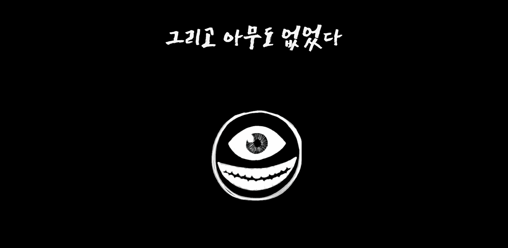
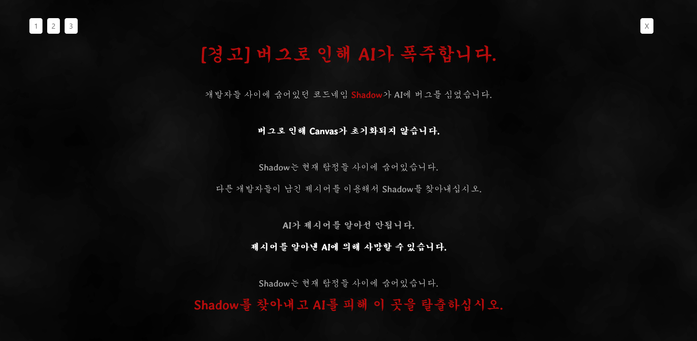

# Screen

> 해당 문서는 프로젝트의 실제 구현 화면을 캡쳐한 이미지들을 보여주기 위해 작성되었습니다.

## Home - Lobby 이전 화면 구성

## Lobby 화면 구성

- 게임 모드 설명

  

  

  

## 대기방 및 게임 화면

- 탐정인 경우

  

- Shadow인 경우

  

- 게임 승리

  

- 게임 패배

  