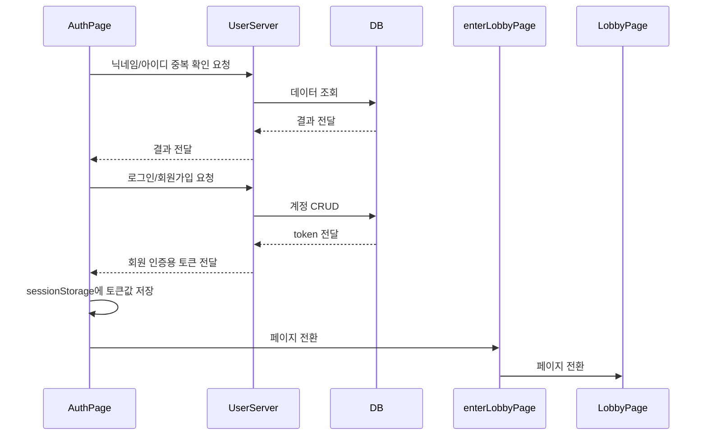

# UserServer

  

> UserServer는 `Frontend`와 `axios`를 사용해 통신합니다.
>
> (다른 Backend 서버들과 직접적으로 통신하지 않습니다.)
>
> UserServer는 `Django`로 구현되었습니다.
>
> MySql DB의 User 테이블과 연결되며, 로그인, 회원가입 등 유저와 관련된 사항들을 처리합니다.


## UserServer Construction

```python
📦gameBack
 ┣ 📂accounts				# 유저 정보 관련 App
 ┃ ┣ 📂migrations
 ┃ ┃ ┣ 📜0001_initial.py
 ┃ ┃ ┗ 📜__init__.py
 ┃ ┣ 📜adapter.py
 ┃ ┣ 📜admin.py
 ┃ ┣ 📜apps.py
 ┃ ┣ 📜consumers.py
 ┃ ┣ 📜models.py
 ┃ ┣ 📜routing.py
 ┃ ┣ 📜serializers.py
 ┃ ┣ 📜tests.py
 ┃ ┣ 📜token_auth.py
 ┃ ┣ 📜urls.py
 ┃ ┣ 📜views.py
 ┃ ┗ 📜__init__.py
 ┣ 📂gameBack				# UserServer의 setting을 위한 디렉토리
 ┃ ┣ 📜asgi.py
 ┃ ┣ 📜routing.py
 ┃ ┣ 📜settings.py
 ┃ ┣ 📜urls.py
 ┃ ┣ 📜wsgi.py
 ┃ ┗ 📜__init__.py
 ┣ 📜manage.py
 ┗ 📜requirements.txt
```


## Sequence Diagram

> 회원가입, 로그인 및 회원 정보 확인 sequence diagram




| 이름             | 위치     | 역할                   | 포트번호/주소 |
| ---------------- | -------- | ---------------------- | ------------- |
| `AuthPage`       | Frontend | 로그인/회원가입 페이지 | -             |
| `EnterLobbyPage` | Frontend | 로비 이동 페이지       | -             |
| LobbyPage        | Frontend | 로비 페이지            | -             |
| `UserServer`     | Backend  | 사용자 CRUD 서버       | 8000          |
| `DB`             | DataBase | 전체 Database (MySQL)  | 3306          |